<div align="center">

# Menoufia University
### Faculty of Computers and Information

<br><br><br>

# EDUNEST
### Next-Generation Mentorship & Structured-Learning Platform
### Graduation Project Book

<br>

**By**

**Omar Medhat Sadek**<br>
**Hazem Saeed El-shazly**<br>
**Elsayed Elsedeek Elsayed**<br>
**Shahd Walid Meligy**<br>
**Rahma Ismail Hendawy**<br>
**Toka Nagy El-khateeb**

<br><br>

**Supervised by**

**Prof. Gamal Farouk**

<br><br>

Menoufia University<br>
2025-2026

</div>

<div style="page-break-after: always;"></div>

## Abstract

**The Problem:** The online learning market is flooded with platforms that rely on pre-recorded video content with no human oversight. Completion rates remain critically low, students receive no personal guidance, and they finish courses without verifiable credentials or portfolio-worthy projects. Meanwhile, industry experts who wish to teach lack a unified tool to structure curricula, communicate with learners, and track their progress.

**The Solution:** EduNest is a mentor-led, structured-learning platform that bridges the gap between passive online courses and real mentorship. It empowers mentors to design week-by-week learning journeys containing lectures, quizzes, tasks, and capstone projects, while students engage through real-time chat, live video sessions, gamified badges, and earn verifiable PDF certificates upon completion.

**Technologies:** Java 21, Spring Boot 3.5.7, Spring Security 6 with stateless JWT (jjwt 0.12.5), MySQL 8, Spring Data JPA (Hibernate), Spring WebSocket + STOMP, Apache Tika 2.9.2, iText7 7.2.5, Jitsi Meet, Spring Mail, springdoc-openapi 2.7, Lombok, Thymeleaf, Docker, Maven.

**Key Features:** OTP-based registration, mentorship lifecycle management (DRAFT → ACTIVE → COMPLETED), weekly curriculum builder, auto-graded MCQ quizzes, task & project submissions with file upload security (Apache Tika), live sessions via Jitsi with attendance tracking, real-time group & private chat (WebSocket STOMP), gamification engine (badges, points, leaderboards), automated PDF certificates (iText7), student skill portfolios, mentor analytics dashboard, and a full admin console.

**The Result:** A production-grade, modular educational ecosystem where every completed learning journey produces a verifiable certificate, a portfolio of submitted projects, and a public skill profile — turning passive learning into measurable, mentor-driven outcomes.

<div style="page-break-after: always;"></div>

## Table of Contents
1. [Chapter 1: Introduction](#chapter-1-introduction)
2. [Chapter 2: Feasibility Study](#chapter-2-feasibility-study)
3. [Chapter 3: System Analysis](#chapter-3-system-analysis)
4. [Chapter 4: UML Diagrams](#chapter-4-uml-diagrams)
5. [Chapter 5: Database Design](#chapter-5-database-design)
6. [Chapter 6: System Architecture](#chapter-6-system-architecture)
7. [Chapter 7: Technologies Used](#chapter-7-technologies-used)
8. [Chapter 8: UI/UX Design](#chapter-8-uiux-design)
9. [Chapter 9: Implementation](#chapter-9-implementation)
10. [Chapter 10: Security](#chapter-10-security)
11. [Chapter 11: Testing](#chapter-11-testing)
12. [Chapter 12: Future Work](#chapter-12-future-work)
13. [Chapter 13: Conclusions](#chapter-13-conclusions)
14. [Chapter 14: References](#chapter-14-references)
15. [Chapter 15: Appendices](#chapter-15-appendices)

<div style="page-break-after: always;"></div>

# Chapter 1: Introduction

## 1.1 Project Idea
EduNest is a mentor-centric, structured-learning platform. Instead of delivering passive video catalogs, it empowers real industry experts (Mentors) to build week-by-week guided learning paths — each week containing lectures, quizzes, hands-on tasks, and capstone projects. Students enroll, progress through the curriculum, earn points and badges, communicate with their mentors via real-time chat, attend live sessions, and receive verifiable PDF certificates upon completion.

## 1.2 Importance of the Project
Traditional online courses suffer from extremely low completion rates because there is no human accountability. EduNest solves this by making the mentor the centerpiece of the experience — providing structured checkpoints, real-time communication, graded submissions, and a gamified reward system that keeps students engaged throughout the entire journey.

## 1.3 Problem Statement
1. **Zero Accountability:** Pre-recorded courses have no human checkpoints. Students drop out with no consequence.
2. **No Real Mentorship:** Q&A forums and email feedback are slow, fragmented, and impersonal.
3. **Unverifiable Outcomes:** Students complete courses without tangible proof — no project portfolio, no recognized certificate, no skill validation.
4. **Mentor Tool Fragmentation:** Experts who want to teach must juggle multiple platforms (Zoom for sessions, Discord for chat, Google Forms for quizzes, spreadsheets for grades). There is no single tool that unifies curriculum delivery, student tracking, and communication.

## 1.4 Objectives
- Build a platform where Mentors can create structured mentorships composed of Weeks, Lectures, Quizzes, Tasks, and Projects.
- Provide Students with a clear, guided learning path from enrollment to certification.
- Implement real-time group and private chat (WebSocket STOMP) to foster cohort communication.
- Enable live video sessions via Jitsi Meet with automatic attendance tracking.
- Build a gamification engine (points per mentorship, badges with categories, cohort leaderboards) to sustain student engagement.
- Automate quiz grading (MCQ: A/B/C/D) while supporting manual grading for tasks and projects.
- Generate verifiable PDF certificates using iText7 upon mentorship completion.
- Give students a public profile showcasing their skills, badges, certificates, and social links.

## 1.5 Target Audience
| Audience     | What They Need                                             | How EduNest Serves Them                                                                                                               |
| ------------ | ---------------------------------------------------------- | ------------------------------------------------------------------------------------------------------------------------------------- |
| **Students** | Structured guidance, real feedback, recognized credentials | Weekly curricula, mentor chat, quizzes, projects, certificates, badges, points, leaderboards                                          |
| **Mentors**  | A platform to teach, manage cohorts, and track progress    | Mentorship CRUD, curriculum builder, live sessions, grading tools, commission tracking, analytics dashboard                           |
| **Admins**   | Platform oversight and moderation                          | Admin console with user management, admin badges (TOP_MENTOR, ACADEMIC_EXCELLENCE, etc.), contact message handling, payments overview |

## 1.6 Scope

### 1.6.1 In Scope
- JWT authentication with email OTP verification (VERIFY, RESET, DELETE, RESTORE, CHANGE_EMAIL).
- Mentorship creation with cover images, tags, "What Will Learn" items, pricing, discounts, difficulty levels (ALL_LEVEL, BEGINNER, INTERMEDIATE, EXPERT), and publishing workflow (DRAFT → ACTIVE → COMPLETED).
- Weekly curriculum builder: each Week contains Lectures (video URL), Quizzes (MCQ A/B/C/D with auto-grading), Tasks (with file submissions and manual grading), and Projects (with file submissions, deadlines, and points).
- Live sessions via Jitsi Meet with session scheduling (SCHEDULED → LIVE → ENDED) and attendance tracking.
- Real-time chat via WebSocket STOMP: group chat rooms per mentorship cohort + private 1-to-1 conversations.
- Gamification: Badges per mentorship (8 categories: ACHIEVEMENT, PERFORMANCE, CONSISTENCY, PROBLEM_SOLVING, CREATIVITY, LEADERSHIP, COMMUNITY, SPECIAL_RECOGNITION), total points per student per mentorship, and leaderboards.
- PDF certificate generation via iText7 with student rank.
- Student profile with skills, social media links (GITHUB, LINKEDIN, FACEBOOK), badges, and certificates.
- Mentor dashboard with enrollment analytics, commissions, and submission queues.
- Admin console: user directory, admin badges (TOP_MENTOR, ACADEMIC_EXCELLENCE, COMMUNITY_LEADER, INNOVATOR_AWARD), contact message management, and payments overview.
- Notifications system (ANNOUNCEMENT, QUIZ, SESSION, TASK, PROJECT, SUPPORT, BADGE, CERTIFICATE, LIVE_SESSION, MENTORSHIP, REVIEW).
- Public "Contact Us" form.

### 1.6.2 Out of Scope
- Direct payment processing (Stripe/PayPal). Commission and pricing are tracked but not transacted.
- Native video hosting. Lectures use external URLs; live sessions use Jitsi Meet links.
- AI-driven content generation or adaptive learning.
- Mobile application (planned for future).

<div style="page-break-after: always;"></div>

# Chapter 2: Feasibility Study

## 2.1 Technical Feasibility
The project is built on **Java 21** and **Spring Boot 3.5.7** — a mature, battle-tested enterprise stack with long-term support. The chosen integrations (WebSocket for real-time chat, Apache Tika for file validation, iText7 for PDFs, Jitsi for live sessions) are all well-documented, open-source, and fully compatible with Spring. The modular, domain-driven package structure ensures the codebase remains maintainable as it grows.

## 2.2 Economic Feasibility
All core technologies are open-source (Java, Spring Boot, MySQL, Jitsi). The only operational cost is cloud hosting. The platform's business model (mentorship enrollment fees with platform commission tracked via the `Enrollment.platformProfit` field) provides a clear revenue path with minimal upfront investment.

## 2.3 Operational Feasibility
EduNest replaces a fragmented toolset (LMS + Zoom + Discord + Google Forms) with a single, role-specific dashboard. Students see their enrolled mentorships, weekly progress, chat, and achievements. Mentors see their curriculum builder, submissions queue, and analytics. Admins see user management and platform health. This consolidation ensures a minimal learning curve for all three user types.

<div style="page-break-after: always;"></div>

# Chapter 3: System Analysis

## 3.1 Functional Requirements

### Authentication & Account Management
- User registration as Student or Mentor with email and password.
- OTP verification sent via email (types: VERIFY, RESET, DELETE, RESTORE, CHANGE_EMAIL).
- Expired OTP cleanup via scheduled background task (`OtpCleanupService`).
- JWT token generation on login; all subsequent requests authenticated via `Authorization: Bearer <token>`.
- Account settings: theme mode (LIGHT/DARK), profile image upload, password change.
- Soft deletion of user accounts (via `deleted` boolean flag on `UserEntity`).

### Mentorship Management
- Mentor creates a mentorship with: title, subtitle, description, category, difficulty level, price, discount percentage, cover image, tags, and "What Will Learn" items.
- Mentorship status lifecycle: DRAFT → ACTIVE → COMPLETED.
- Students browse the homepage catalog, filter by category/difficulty/rating, and enroll.
- Upon enrollment, `Enrollment` record is created with price and `platformProfit`.
- Students and Mentors can write `MentorShipReviews` with ratings.

### Curriculum & Assessment
- Each Mentorship contains ordered **Weeks**.
- Each Week contains:
  - **Lectures**: title + external video URL.
  - **Quizzes**: title, description, duration in minutes, status (DRAFT/PUBLISHED/CLOSED). Each Quiz has multiple **Questions** with 4 choices (A, B, C, D) and a correct answer. Students submit **QuizSubmissions** containing **StudentAnswers**, and the system auto-grades them.
  - **Tasks**: title, description, points, pass points, estimated minutes, due date, optional attachment. Students upload **TaskSubmissions** (files validated by Apache Tika). Mentors grade manually (status: SUBMITTED → GRADED).
  - **Projects**: title, brief, goal, description URL, optional attachment, start/end dates, points. Students upload **ProjectSubmissions** with file attachments. Mentors grade manually.

### Live Sessions
- Mentors schedule sessions linked to a Week (title, scheduledAt, status: SCHEDULED → LIVE → ENDED).
- Meeting URL generated via **Jitsi Meet** (`JitsiService` creates `https://meet.jit.si/EduNest_Session_<id>_<uuid>`).
- **SessionAttendance** and **SessionAttendanceResult** entities track which students attended.

### Real-Time Chat
- Group **ChatRoom** per mentorship cohort with **ChatRoomMembers**.
- **ChatMessages** persisted in DB and broadcasted via WebSocket STOMP.
- Private 1-to-1 **Conversations** with **Messages** between any two users.
- WebSocket secured via `JwtHandshakeInterceptor` (HTTP upgrade) and `JwtChannelInterceptor` (per-message auth using `ChatPrincipal`).

### Gamification
- **Badges**: Created by mentors per mentorship. Each badge has a title, category (8 types), description, and point threshold (1–500).
- **BadgeAwards**: Granted to students when they reach a badge's point threshold.
- **TotalPoints**: Tracks cumulative points per student per mentorship (unique constraint on student_id + mentorship_id).
- **Leaderboards**: Ranked view of students within a mentorship (`MentorshipLeaderboardService`).
- **AdminBadges**: Platform-wide badges issued by admins (TOP_MENTOR, ACADEMIC_EXCELLENCE, COMMUNITY_LEADER, INNOVATOR_AWARD) tracked via `UserAdminBadge`.

### Certificates
- Generated as PDF via **iText7** when a student completes a mentorship.
- `Certificate` entity stores: student, mentorship, rank (student's position), and issuedAt timestamp.
- Unique constraint ensures one certificate per student per mentorship.

### Notifications
- `Notification` entity with types: ANNOUNCEMENT, QUIZ, SESSION, TASK, PROJECT, SUPPORT, BADGE, CERTIFICATE, LIVE_SESSION, MENTORSHIP, REVIEW.
- `UserNotification`: targeted notifications for specific users.
- `AdminNotification`: platform-wide admin broadcasts.

### Student Profile & Skills
- Students can add **StudentSkills** (skill name linked to student).
- **SocialMedia** links: GITHUB, LINKEDIN, FACEBOOK.
- Public profile aggregates: skills, badges, certificates, enrollments, and reviews.
- Student educational level: FRESH, JUNIOR, SENIOR.

### Admin Console
- **AdminUserDirectory**: View, search, and manage all platform users.
- **AdminBadgeService**: Create and assign platform-wide admin badges.
- **ContactMessageService**: Handle incoming "Contact Us" messages (status: PENDING → UNDER_REVIEW → COMPLETED).
- **Payments**: View platform commission data from enrollments.
- **Dashboard**: Platform-wide analytics and statistics.

### Mentor Dashboard
- **MentorDashboardController**: View enrollment statistics, revenue (commissions), and submission queues.
- **MentorshipDashboardService**: Per-mentorship analytics.
- **MentorProfileInfoService**: Manage mentor public profile (jobTitle, bio, yearsOfExperience).

## 3.2 Non-Functional Requirements
- **Security:** Stateless JWT auth, BCrypt password hashing, RBAC via `@PreAuthorize`, Apache Tika file validation, WebSocket-level JWT verification, environment-aware security configs (dev vs prod profiles), CORS policy, soft deletion.
- **Performance:** Database indexes on `mentorship(mentor_id, status)`, `enrollments(student_id, mentorship_id)`, `quiz(week_id)`, `tasks(week_id)`, `projects(week_id)`, `lectures(week_id)`, `sessions(week_id)`. FetchType.LAZY on all relationships. DTO projections to minimize payload sizes.
- **Scalability:** Fully stateless (no HTTP sessions). Modular monolith structured for future microservice extraction.
- **Maintainability:** Domain-driven packaging, DTO boundaries, global exception handling, automated JPA auditing (`createdAt`, `updatedAt`, `createdBy`, `updatedBy` on every entity).

## 3.3 Users and Roles

### STUDENT
- Register with email/password, verify via OTP.
- Browse and enroll in mentorships.
- View weekly curriculum (lectures, quizzes, tasks, projects).
- Submit quiz answers (auto-graded), task files, and project files.
- Join live sessions via Jitsi and have attendance recorded.
- Chat in mentorship group rooms and private conversations.
- Earn points and unlock badges per mentorship.
- View leaderboard position within a cohort.
- Receive a PDF certificate upon completion.
- Build a public profile with skills (StudentSkill) and social links (GITHUB, LINKEDIN, FACEBOOK).
- Write reviews and ratings for mentorships.

### MENTOR
- Register with email/password, verify via OTP.
- Create and manage mentorships (title, description, category, price, cover image, tags, "What Will Learn").
- Build weekly curriculum: add Lectures (URL), Quizzes (MCQ), Tasks (with points, deadlines, attachments), Projects (with briefs, goals, deadlines, points).
- Schedule and start live sessions (Jitsi links generated automatically).
- Grade task and project submissions manually (SUBMITTED → GRADED).
- Create badges for their mentorships (with point thresholds and categories).
- View mentor dashboard with enrollment analytics, revenue/commission tracking, and pending submissions.
- Chat with enrolled students in group rooms and private conversations.
- Manage profile (jobTitle, bio, yearsOfExperience).

### ADMIN
- Manage all platform users (view, search via `AdminUserDirectory`).
- Seed default roles on startup (`RolesSeeder` bootstraps STUDENT, MENTOR, ADMIN roles).
- Create and assign platform-wide admin badges (TOP_MENTOR, ACADEMIC_EXCELLENCE, COMMUNITY_LEADER, INNOVATOR_AWARD).
- Handle "Contact Us" messages (PENDING → UNDER_REVIEW → COMPLETED).
- View payments overview (platform commission data from enrollments).
- View platform-wide analytics dashboard.
- Send admin-level notifications.
- Manage own profile and settings.

<div style="page-break-after: always;"></div>

# Chapter 4: UML Diagrams

## 4.1 Use Case Diagram
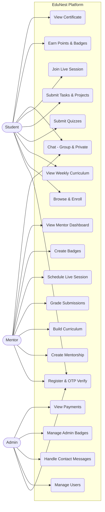

## 4.2 Class Diagram (Core Domain)
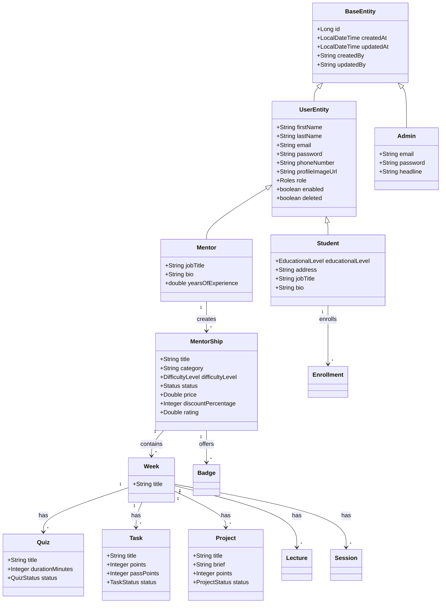

## 4.3 Sequence Diagram: Registration & OTP
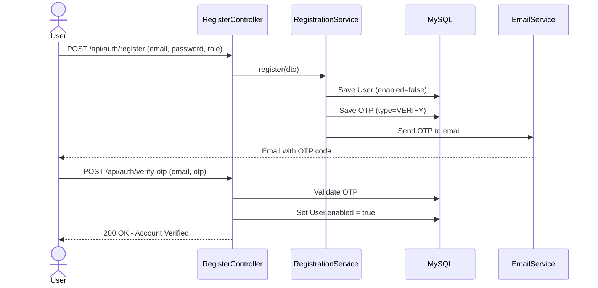

## 4.4 Sequence Diagram: Login & JWT Auth
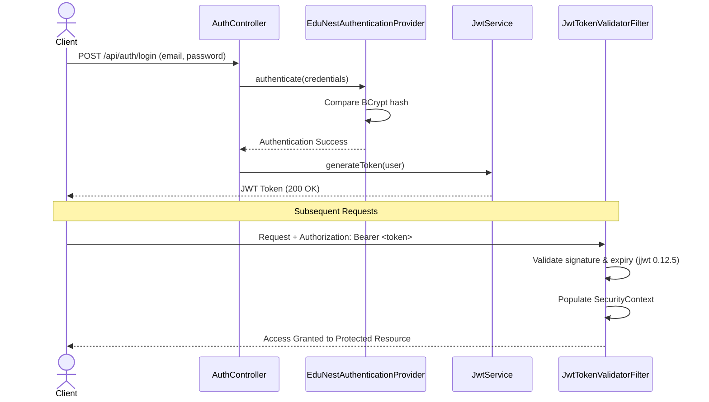

## 4.5 Sequence Diagram: Project Submission Flow
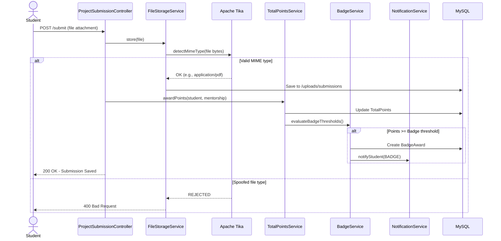

## 4.6 Activity Diagram: Student Enrollment & Learning Journey
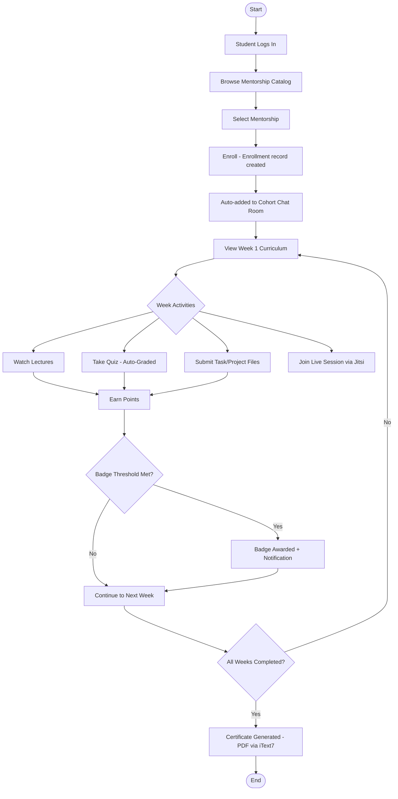

## 4.7 Entity Relationship Diagram (ERD)
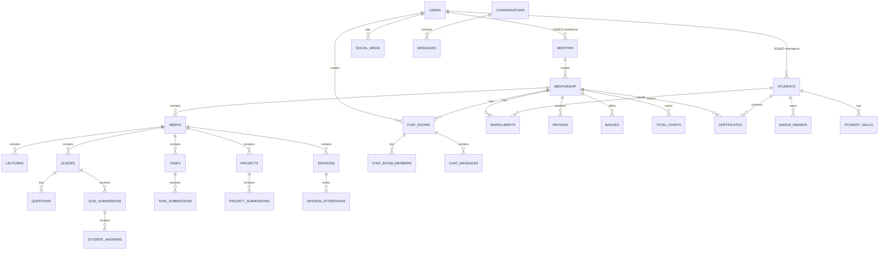

## 4.8 Data Flow Diagram (DFD Level 0)
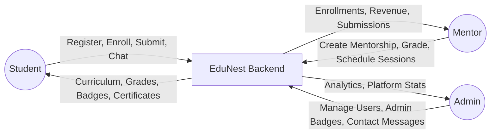

## 4.9 State Diagram: Mentorship Lifecycle
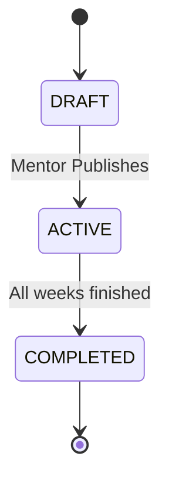

## 4.10 State Diagram: Live Session Lifecycle
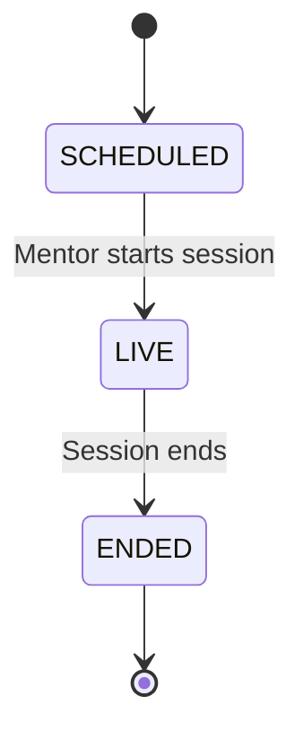

## 4.11 State Diagram: Task/Quiz Status
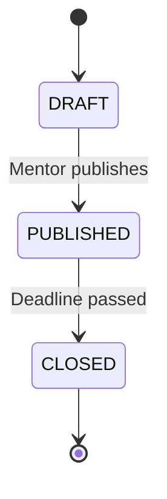

<div style="page-break-after: always;"></div>

# Chapter 5: Database Design

## 5.1 Schema Overview
The database uses **MySQL 8** with a highly normalized relational schema. The system applies **JOINED Inheritance** for users (UserEntity → Student / Mentor), ensuring strict referential integrity while isolating role-specific data in separate tables.

## 5.2 Base Entity (Auditing)
Every table in the system inherits from `BaseEntity`, a `@MappedSuperclass` that provides:
- `id` (auto-generated primary key)
- `createdAt` (auto-populated via `@CreationTimestamp`)
- `updatedAt` (auto-populated via `@UpdateTimestamp`)
- `createdBy` (auto-populated via `@CreatedBy` + `AuditorAwareImpl`)
- `updatedBy` (auto-populated via `@LastModifiedBy`)

This ensures full audit traceability on every single record in the database without any manual effort from the developer.

## 5.3 Key Tables and Relationships

| Table                 | Key Columns                                                                                                                            | Relationships                                                                                                                 |
| --------------------- | -------------------------------------------------------------------------------------------------------------------------------------- | ----------------------------------------------------------------------------------------------------------------------------- |
| `users`               | firstName, lastName, email, password, role_id, enabled, deleted                                                                        | Parent to `students`, `mentors`. Has many `social_media`, `chat_rooms`                                                        |
| `students`            | student_id (FK to users), educationalLevel, address, jobTitle, bio                                                                     | Has many `enrollments`, `reviews`, `badge_awards`, `student_skills`                                                           |
| `mentors`             | mentor_id (FK to users), jobTitle, bio, yearsOfExperience                                                                              | Has many `mentorships`                                                                                                        |
| `roles`               | name (STUDENT, MENTOR, ADMIN)                                                                                                          | Referenced by `users.role_id`                                                                                                 |
| `admin`               | email, password, firstName, lastName, headline, role                                                                                   | Separate from UserEntity hierarchy                                                                                            |
| `mentorship`          | title, subtitle, description, category, rating, difficultyLevel, status, price, discountPercentage, coverImageUrl, duration, mentor_id | Has many `weeks`, `tags`, `what_will_learn`, `enrollments`, `reviews`, `chat_rooms`, `total_points`, `badges`, `certificates` |
| `weeks`               | title, mentorship_id                                                                                                                   | Has many `lectures`, `quizzes`, `tasks`, `projects`, `sessions`                                                               |
| `lectures`            | lecture_title, lecture_url, week_id                                                                                                    | Belongs to `weeks`                                                                                                            |
| `quiz`                | title, description, durationMinutes, status, week_id                                                                                   | Has many `questions`, `quiz_submissions`                                                                                      |
| `questions`           | quiz_id, choices A/B/C/D, correctAnswer                                                                                                | Belongs to `quiz`                                                                                                             |
| `quiz_submissions`    | quiz_id, student_id                                                                                                                    | Has many `student_answers`                                                                                                    |
| `tasks`               | task_title, task_description, task_points, task_pass_points, task_estimated_minutes, task_status, task_due_at, week_id                 | Has many `task_submissions`                                                                                                   |
| `task_submissions`    | task_id, student_id, status (SUBMITTED/GRADED)                                                                                         | Belongs to `tasks`                                                                                                            |
| `projects`            | project_title, project_brief, project_goal, project_start_at, project_end_at, project_points, project_status, week_id                  | Has many `project_submissions`                                                                                                |
| `sessions`            | title, scheduledAt, actualStartTime, actualEndTime, meetingUrl, status, week_id                                                        | Has many `session_attendance`, `session_attendance_results`                                                                   |
| `enrollments`         | student_id, mentorship_id, price, platformProfit, joinedAt                                                                             | Index on (student_id, mentorship_id)                                                                                          |
| `badges`              | title, category, description, points, mentorship_id                                                                                    | Has many `badge_awards`                                                                                                       |
| `total_points`        | student_id, mentorship_id, totalPoints                                                                                                 | Unique constraint on (student_id, mentorship_id)                                                                              |
| `certificates`        | student_id, mentorship_id, rank, issuedAt                                                                                              | Unique constraint on (student_id, mentorship_id)                                                                              |
| `chat_rooms`          | mentorship_id, creator_id                                                                                                              | Has many `chat_room_members`, `chat_messages`                                                                                 |
| `conversations`       | user1, user2                                                                                                                           | Has many `messages`                                                                                                           |
| `contact_message`     | name, email, phone, message, status (PENDING/UNDER_REVIEW/COMPLETED)                                                                   | Public contact form                                                                                                           |
| `admin_badges`        | type (TOP_MENTOR, ACADEMIC_EXCELLENCE, etc.)                                                                                           | Admin-level badges                                                                                                            |
| `user_admin_badges`   | user_id, admin_badge_id                                                                                                                | Tracks user-to-admin-badge assignments                                                                                        |
| `notifications`       | type, message                                                                                                                          | Base notification entity                                                                                                      |
| `user_notifications`  | user_id, notification_id                                                                                                               | Targeted notifications                                                                                                        |
| `admin_notifications` | notification_id                                                                                                                        | Platform-wide admin broadcasts                                                                                                |

## 5.4 Database Indexes
Explicit indexes are defined for performance on frequently queried columns:
- `idx_mentorship_mentor_id` on `mentorship(mentor_id)`
- `idx_mentorship_status` on `mentorship(status)`
- `idx_enrollments_student_mentorship` on `enrollments(student_id, mentorship_id)`
- `idx_quiz_week_id` on `quiz(week_id)`
- `idx_task_week_id` on `tasks(week_id)`
- `idx_project_week_id` on `projects(week_id)`
- `idx_lectures_week_id` on `lectures(week_id)`
- `idx_session_week_id` on `sessions(week_id)`

## 5.5 Data Integrity Mechanisms
- **Soft Deletion:** `UserEntity.deleted` boolean flag preserves relational history when accounts are deactivated.
- **Unique Constraints:** Enforced on `users.email`, `certificates(student_id, mentorship_id)`, `total_points(student_id, mentorship_id)`.
- **Cascade Operations:** `CascadeType.ALL` with `orphanRemoval = true` on parent-child relationships (e.g., deleting a Week cascades to its Lectures, Quizzes, Tasks, Projects).
- **Lazy Loading:** All `@ManyToOne` and `@OneToMany` relations use `FetchType.LAZY` to prevent N+1 query issues.

<div style="page-break-after: always;"></div>

# Chapter 6: System Architecture

## 6.1 Architectural Style
EduNest follows a **Modular Monolith** architecture with **Domain-Driven Packaging**. The codebase is organized by business domain rather than by technical layer:

```
com.example.gradproj.EduNest/
├── controller/
│   ├── auth/          (AuthController)
│   ├── mentorShip/    (mentorShipControllers)
│   ├── quiz/          (QuizController, QuestionController, QuizSubmissionController)
│   ├── tasks/         (TaskController, TaskSubmissionController)
│   ├── projects/      (ProjectController, ProjectSubmissionController)
│   ├── livesession/   (LiveSessionController)
│   ├── chat/          (chatRestControllers, ChatWebSocketController, ConversationRestControllers, ConversationWebSocketControllers)
│   ├── badges/        (BadgeController, BadgeAwardController)
│   ├── weeks/         (WeekController, StudentWeekController)
│   ├── lecture/       (LectureController)
│   ├── profile/       (StudentProfileController, MentorProfileInfoController, MentorProfileForStudent, MentorViewStudentProfileController)
│   ├── notification/  (NotificationController)
│   ├── skill/         (StudentSkillsController)
│   ├── homepage/      (HomePageController)
│   ├── admin/         (AdminController, AdminBadgeController, AdminDashboardController, AdminPaymentsController, AdminUserDirectoryController, AdminNotificationController, AdminProfileAndSettingsController)
│   ├── MentorDashboard/ (MentorDashboardController)
│   ├── register/      (UserManagementController)
│   ├── studentAchievementController/ (StudentAchievementController)
│   ├── studentCertificates/ (StudentCertificatesController)
│   ├── studentMentorship/ (MentorshipOverviewController)
│   ├── mylearning/    (MyLearningController)
│   ├── contactus/     (ContactMessageController)
│   ├── account/       (SettingsController)
│   └── file/          (FileController)
├── service/           (mirrors controller structure)
├── repository/        (Spring Data JPA interfaces + projections)
├── entity/            (JPA entities per domain)
├── dto/               (request/response DTOs per domain)
├── enums/             (domain-specific enumerations)
├── config/            (security, WebSocket, Swagger, auth, roles seeder)
├── filters/           (JwtTokenGeneratorFilter, JwtTokenValidatorFilter)
├── exception/         (GlobalExceptionHandler)
├── auditing/          (AuditorAwareImpl)
├── annotation/        (custom annotations)
├── validation/        (PasswordMatches, PasswordMatchesValidator)
├── security/          (CurrentUserProvider)
└── util/utils/        (Constants, SystemUtils, FileResponseBuilder)
```

## 6.2 Layered Decomposition
```
┌──────────────────────────────────────────────────────────────┐
│  Controllers (42 REST + 2 WebSocket STOMP endpoints)         │
├──────────────────────────────────────────────────────────────┤
│  Services (business logic, @Transactional, orchestration)    │
├──────────────────────────────────────────────────────────────┤
│  Repositories (Spring Data JPA + custom projections)         │
├──────────────────────────────────────────────────────────────┤
│  Entities (JPA @Entity, JOINED inheritance, BaseEntity)      │
├──────────────────────────────────────────────────────────────┤
│  MySQL 8 Database                                            │
└──────────────────────────────────────────────────────────────┘

Cross-cutting Concerns:
  • JwtTokenGeneratorFilter / JwtTokenValidatorFilter
  • JwtHandshakeInterceptor / JwtChannelInterceptor (WebSocket)
  • GlobalExceptionHandler (@ControllerAdvice)
  • AuditorAwareImpl (auto-populates createdBy/updatedBy)
  • FileStorageService + Apache Tika (secure uploads)
  • EmailService (OTP via SMTP)
```

## 6.3 API Endpoint Map

| Domain               | Base Path                | Key Operations                                                                   |
| -------------------- | ------------------------ | -------------------------------------------------------------------------------- |
| **Auth**             | `/api/auth/`             | `POST /login`, `POST /register`, `POST /verify-otp`                              |
| **Mentorships**      | `/api/v1/mentorships/`   | `GET /browse`, `POST /create`, `POST /{id}/enroll`, `PUT /publish`               |
| **Weeks**            | `/api/v1/weeks/`         | `POST /create`, `GET /{mentorshipId}/weeks`                                      |
| **Lectures**         | `/api/v1/lectures/`      | `POST /create`, `GET /{weekId}/lectures`                                         |
| **Quizzes**          | `/api/v1/quiz/`          | `POST /create`, `POST /{id}/submit`, `GET /{id}/results`                         |
| **Tasks**            | `/api/v1/tasks/`         | `POST /create`, `POST /{id}/submit`, `PUT /{id}/grade`                           |
| **Projects**         | `/api/v1/projects/`      | `POST /create`, `POST /{id}/submit`, `PUT /{id}/grade`                           |
| **Live Sessions**    | `/api/v1/livesession/`   | `POST /schedule`, `POST /{id}/start`, `POST /{id}/attendance`                    |
| **Chat**             | `/api/v1/chat/` + `/ws/` | `GET /rooms`, `GET /messages`, STOMP subscribe/send                              |
| **Conversations**    | `/api/v1/conversations/` | `POST /create`, `GET /messages`                                                  |
| **Badges**           | `/api/v1/badges/`        | `POST /create`, `GET /{mentorshipId}/badges`, `GET /leaderboard`                 |
| **Profile**          | `/api/v1/profile/`       | `GET /me`, `PUT /update`, `GET /mentor/{id}`                                     |
| **Skills**           | `/api/v1/skills/`        | `POST /add`, `DELETE /{id}`                                                      |
| **Certificates**     | `/api/v1/certificates/`  | `GET /my-certificates`, `GET /{id}/download`                                     |
| **Notifications**    | `/api/v1/notifications/` | `GET /`, `PUT /{id}/read`                                                        |
| **Homepage**         | `/api/v1/homepage/`      | `GET /featured`, `GET /categories`                                               |
| **Admin**            | `/api/v1/admin/`         | `GET /users`, `POST /badges`, `GET /contacts`, `GET /payments`, `GET /dashboard` |
| **Mentor Dashboard** | `/api/v1/dashboard/`     | `GET /enrollments`, `GET /revenue`, `GET /submissions`                           |
| **Contact Us**       | `/api/v1/contact/`       | `POST /submit`                                                                   |
| **Swagger UI**       | `/swagger-ui.html`       | Interactive API docs                                                             |

<div style="page-break-after: always;"></div>

# Chapter 7: Technologies Used

| Technology                  | Version      | Purpose in EduNest                                                                 |
| --------------------------- | ------------ | ---------------------------------------------------------------------------------- |
| **Java**                    | 21           | Primary backend language with modern syntax and LTS support                        |
| **Spring Boot**             | 3.5.7        | Core framework — auto-configuration, embedded Tomcat, dependency injection         |
| **Spring Security**         | 6            | Authentication & authorization framework (filter chain, RBAC)                      |
| **jjwt**                    | 0.12.5       | JWT token generation, signing, and validation (jjwt-api, jjwt-impl, jjwt-jackson)  |
| **Spring Data JPA**         | (via Boot)   | Repository abstraction over Hibernate ORM for MySQL queries                        |
| **Hibernate**               | (via Boot)   | JPA implementation — entity mapping, JOINED inheritance, lazy loading              |
| **MySQL**                   | 8.0.33       | Relational database — ACID compliance, indexing, foreign keys                      |
| **Spring WebSocket**        | (via Boot)   | STOMP protocol for real-time bidirectional chat and notifications                  |
| **Apache Tika**             | 2.9.2        | File MIME-type validation via magic bytes — prevents spoofed uploads               |
| **iText7**                  | 7.2.5        | Programmatic PDF generation for completion certificates                            |
| **Jitsi Meet**              | (external)   | Free, open-source video conferencing — meeting URL generation                      |
| **Spring Mail**             | (via Boot)   | SMTP integration for OTP emails and notification emails                            |
| **springdoc-openapi**       | 2.7.0        | Auto-generated Swagger UI for interactive API documentation                        |
| **Thymeleaf**               | (via Boot)   | Server-side template engine for email HTML templates                               |
| **Lombok**                  | (via Boot)   | Boilerplate reduction: `@Getter`, `@Setter`, `@SuperBuilder`, `@NoArgsConstructor` |
| **Jakarta Bean Validation** | (via Boot)   | Declarative input validation: `@Valid`, `@NotBlank`, `@Email`, `@Min`, `@Max`      |
| **Maven**                   | (wrapper)    | Build tool, dependency management, fat-jar packaging                               |
| **Docker**                  | (Dockerfile) | Containerization for portable deployment                                           |

<div style="page-break-after: always;"></div>

# Chapter 8: UI/UX Design

`[🖼️ INSERT SCREENSHOT: Login / Registration Page]`

`[🖼️ INSERT SCREENSHOT: OTP Verification Screen]`

`[🖼️ INSERT SCREENSHOT: Student Homepage — Mentorship Catalog with cards, ratings, tags]`

`[🖼️ INSERT SCREENSHOT: Mentorship Detail Page — What You Will Learn, curriculum preview, Enroll button]`

`[🖼️ INSERT SCREENSHOT: Student Weekly View — Lectures, Quizzes, Tasks, Projects for current week]`

`[🖼️ INSERT SCREENSHOT: Quiz Taking Interface — MCQ with A/B/C/D choices]`

`[🖼️ INSERT SCREENSHOT: Task/Project Submission — File upload form]`

`[🖼️ INSERT SCREENSHOT: Live Session Page — Jitsi meeting embedded or linked]`

`[🖼️ INSERT SCREENSHOT: Real-Time Chat — Group chat room and/or private conversation]`

`[🖼️ INSERT SCREENSHOT: Student Profile — Skills, Badges, Certificates, Social Links]`

`[🖼️ INSERT SCREENSHOT: Leaderboard — Ranked students within a mentorship cohort]`

`[🖼️ INSERT SCREENSHOT: Generated PDF Certificate]`

`[🖼️ INSERT SCREENSHOT: Mentor Dashboard — Enrollments, Revenue, Submissions Queue]`

`[🖼️ INSERT SCREENSHOT: Mentor Curriculum Builder — Adding Weeks, Lectures, Quizzes]`

`[🖼️ INSERT SCREENSHOT: Admin Console — User Directory / Admin Badges / Contact Messages]`

<div style="page-break-after: always;"></div>

# Chapter 9: Implementation

## 9.1 Build & Run
- **Build Tool:** Apache Maven (wrapper included: `mvnw` / `mvnw.cmd`).
- **Packaging:** Spring Boot Maven Plugin bundles the app into an executable `.jar`.
- **Containerization:** `Dockerfile` and `.dockerignore` enable Docker-based deployment.
- **Profiles:** `ProjectSecurityConfig` (dev — relaxed CORS/Swagger) and `ProjectSecurityProdconfig` (prod — locked-down).

## 9.2 Authentication Flow (Actual Implementation)
1. User POSTs credentials to `/api/auth/register`. `RegistrationService` saves user with `enabled=false`, generates OTP, and sends email via `EmailService`.
2. User POSTs OTP to `/api/auth/verify-otp`. System validates OTP (checking type and expiry), sets `enabled=true`.
3. Expired OTPs are cleaned up automatically by `OtpCleanupService` (scheduled background task via `@EnableScheduling`).
4. User POSTs credentials to `/api/auth/login`. `EduNestAuthenticationProvider` validates BCrypt hash. On success, `JwtService` generates a signed JWT.
5. On every subsequent request, `JwtTokenValidatorFilter` extracts the token from `Authorization: Bearer <token>`, validates the signature and expiry using jjwt 0.12.5, and populates the `SecurityContext`.
6. `CurrentUserProvider` utility resolves the authenticated user from `SecurityContext` for use in service-layer operations.

## 9.3 WebSocket Chat Implementation
1. Client establishes a STOMP connection to `/ws`.
2. `JwtHandshakeInterceptor` validates the JWT during the HTTP Upgrade handshake.
3. `JwtChannelInterceptor` enforces per-message authorization and creates a `ChatPrincipal` for each connected user.
4. Messages sent to a group chat room are persisted via `ChatMessageService` and broadcasted to all subscribers on that topic.
5. Private conversations use `ConversationService` — messages are persisted and sent only to the two participants.

## 9.4 File Upload Security (Actual Implementation)
1. Student uploads a file via Task or Project submission endpoint.
2. `FileStorageService` receives the `MultipartFile`.
3. **Apache Tika** inspects the actual binary content (magic bytes) to detect the true MIME type, regardless of the file extension.
4. If the detected MIME type does not match the allowed types, the upload is **rejected** (preventing attacks like a `.exe` renamed to `.pdf`).
5. Valid files are stored in the `/uploads/submissions` directory on the server.

## 9.5 Certificate Generation (Actual Implementation)
1. When a student completes all weeks of a mentorship, `CertificateService` is triggered.
2. The student's rank is calculated based on their `TotalPoints` within the mentorship cohort.
3. **iText7** generates a styled PDF certificate containing the student's name, mentorship title, rank, and issue date.
4. A `Certificate` record is saved in the database (unique constraint on student_id + mentorship_id prevents duplicates).

## 9.6 Design Patterns Applied
| Pattern                  | Where in Code                                                                                                  | Purpose                                             |
| ------------------------ | -------------------------------------------------------------------------------------------------------------- | --------------------------------------------------- |
| **Repository**           | All `repository/` packages                                                                                     | Decouples persistence from business logic           |
| **Service Layer**        | All `service/` packages                                                                                        | Transaction boundaries, business orchestration      |
| **DTO**                  | All `dto/` packages                                                                                            | Decouples API contracts from JPA entities           |
| **Builder**              | `@SuperBuilder` on all entities                                                                                | Clean, readable entity construction                 |
| **Strategy**             | `EduNestAuthenticationProvider`, `FileStorageService`                                                          | Pluggable authentication and storage strategies     |
| **Filter Chain**         | `JwtTokenGeneratorFilter`, `JwtTokenValidatorFilter`                                                           | Stateless request authentication pipeline           |
| **Template Inheritance** | `BaseEntity` → `UserEntity` → `Student`/`Mentor`                                                               | Shared auditing + user polymorphism                 |
| **Observer (Pub/Sub)**   | WebSocket STOMP `@SendTo`, notifications                                                                       | Decoupled real-time event delivery                  |
| **Projection**           | Repository `projection/` packages (e.g., `AuthUserProjection`, `MentorStatsProjection`, `TopMentorProjection`) | Optimized query results without full entity loading |

## 9.7 Global Error Handling
The `GlobalExceptionHandler` (`@ControllerAdvice`) catches all exceptions and returns standardized JSON error responses. Stack traces are never leaked to the client. Handled exceptions include validation errors (`MethodArgumentNotValidException`), entity not found, unauthorized access, and file upload failures.

<div style="page-break-after: always;"></div>

# Chapter 10: Security

| Security Layer           | Implementation                                      | Details                                                                                                       |
| ------------------------ | --------------------------------------------------- | ------------------------------------------------------------------------------------------------------------- |
| **Password Hashing**     | BCrypt (adaptive)                                   | Passwords are never stored in plain text; BCrypt applies a random salt automatically                          |
| **JWT Authentication**   | jjwt 0.12.5                                         | Cryptographically signed tokens with expiry; no server-side session storage needed                            |
| **RBAC**                 | `@PreAuthorize("hasRole('...')")`                   | Endpoints strictly segregated: Students cannot access Mentor endpoints, Mentors cannot access Admin endpoints |
| **OTP Verification**     | Email-based OTP                                     | Prevents fake registrations; supports VERIFY, RESET, DELETE, RESTORE, CHANGE_EMAIL flows                      |
| **File Upload Security** | Apache Tika 2.9.2                                   | Validates real MIME type via magic bytes; blocks spoofed extensions (e.g., `.exe` → `.pdf`)                   |
| **WebSocket Security**   | `JwtHandshakeInterceptor` + `JwtChannelInterceptor` | JWT validated during HTTP upgrade AND on every STOMP message                                                  |
| **Input Validation**     | Jakarta Bean Validation                             | `@Valid`, `@NotBlank`, `@Email`, `@Pattern`, `@Min`, `@Max` on all DTOs                                       |
| **Custom Validators**    | `@PasswordMatches` + `PasswordMatchesValidator`     | Ensures password confirmation matches during registration                                                     |
| **Soft Deletion**        | `UserEntity.deleted` flag                           | Accounts are deactivated, not permanently removed — preserves data integrity                                  |
| **Environment Profiles** | `@Profile("!prod")` / `@Profile("prod")`            | Dev config allows open CORS/Swagger; Prod config locks everything down                                        |
| **CORS Policy**          | `WebConfig` + `CorsConfigurationSource`             | Centrally configured allowed origins, methods, and headers                                                    |
| **CSRF**                 | Disabled (stateless REST)                           | Mitigated by JWT in Authorization header (no cookies)                                                         |

<div style="page-break-after: always;"></div>

# Chapter 11: Testing

## 11.1 Testing Strategies
- **Unit Testing:** JUnit 5 + Mockito — tests individual service methods (e.g., quiz scoring logic, point calculation) in isolation without the Spring context.
- **Integration Testing:** `@SpringBootTest` — verifies end-to-end flow: controller → service → repository → MySQL.
- **User Acceptance Testing:** Manual testing with sample Student, Mentor, and Admin accounts to validate the full learning journey (enrollment → quiz → submission → badge → certificate).

## 11.2 Test Cases

| ID    | Scenario                                                | Expected Result                                         | Status |
| ----- | ------------------------------------------------------- | ------------------------------------------------------- | ------ |
| TC-01 | Student registers and submits correct OTP               | `enabled` set to true, login returns JWT                | ✅ Pass |
| TC-02 | Login with wrong password                               | 401 Unauthorized                                        | ✅ Pass |
| TC-03 | Student uploads a `.exe` file renamed to `.pdf`         | Apache Tika detects mismatch, returns 400               | ✅ Pass |
| TC-04 | Student submits quiz (MCQ A/B/C/D)                      | Auto-graded, score saved, points awarded                | ✅ Pass |
| TC-05 | Mentor creates mentorship with weeks, lectures, quizzes | All entities linked correctly in DB                     | ✅ Pass |
| TC-06 | Student accesses Mentor Dashboard endpoint              | `@PreAuthorize` returns 403 Forbidden                   | ✅ Pass |
| TC-07 | Student sends WebSocket chat message                    | Persisted in DB, broadcasted to cohort room subscribers | ✅ Pass |
| TC-08 | Student earns enough points to reach badge threshold    | `BadgeAward` created, notification sent                 | ✅ Pass |
| TC-09 | Student completes mentorship                            | iText7 generates PDF certificate with rank              | ✅ Pass |
| TC-10 | Mentor schedules and starts live session                | Jitsi URL generated, session status changes to LIVE     | ✅ Pass |
| TC-11 | Admin assigns admin badge (TOP_MENTOR) to a user        | `UserAdminBadge` record created                         | ✅ Pass |
| TC-12 | Expired OTPs                                            | `OtpCleanupService` scheduled task removes them         | ✅ Pass |

<div style="page-break-after: always;"></div>

# Chapter 12: Future Work

- **Payment Gateway Integration:** Stripe/PayPal for real enrollment payments and automated mentor payouts (replacing the current commission tracking).
- **AI-Powered Mentor Matching:** ML algorithms to recommend mentorships based on student skill profiles and goals.
- **Adaptive Learning Quizzes:** Dynamically adjust quiz difficulty based on previous student answers.
- **AI Code Review:** Automated first-pass feedback on project submissions before mentor review.
- **Mobile Application:** Native iOS/Android app (Flutter or React Native) consuming the existing REST + WebSocket APIs.
- **Microservices Extraction:** Splitting Chat, Notifications, and File Storage into independent, horizontally scalable services.
- **Cloud File Storage:** Migrating `/uploads` to AWS S3 or Azure Blob with CDN distribution.
- **Elasticsearch Integration:** Advanced search and filtering for mentorships and mentor discovery.
- **Caching Layer:** Redis for hot data (homepage catalog, leaderboards) to reduce DB load.

<div style="page-break-after: always;"></div>

# Chapter 13: Conclusions

The **EduNest** graduation project successfully delivers a comprehensive, production-grade mentorship and structured-learning platform. By combining a modular monolith architecture (Spring Boot 3.5.7), stateless JWT security, real-time WebSocket communication, gamified engagement (badges, points, leaderboards), and automated PDF certificate generation, EduNest proves that online learning can be structured, accountable, and deeply human. The platform's three roles (Student, Mentor, Admin) each have complete, feature-rich dashboards and workflows, and the domain-driven codebase is architected for clean future expansion into microservices.

<div style="page-break-after: always;"></div>

# Chapter 14: References

1. Spring Boot 3.5 Official Documentation — https://spring.io/projects/spring-boot
2. Spring Security 6 Reference — https://docs.spring.io/spring-security/reference/
3. JSON Web Tokens (JWT) Standards — https://jwt.io/introduction
4. MySQL 8.0 Reference Manual — https://dev.mysql.com/doc/
5. Apache Tika 2.9 Documentation — https://tika.apache.org/
6. iText 7 PDF Library Documentation — https://itextpdf.com/
7. Jitsi Meet Documentation — https://jitsi.github.io/handbook/
8. WebSocket Protocol Specification — RFC 6455
9. springdoc-openapi Documentation — https://springdoc.org/
10. Lombok Project Documentation — https://projectlombok.org/
11. Domain-Driven Design — Eric Evans, Addison-Wesley

<div style="page-break-after: always;"></div>

# Chapter 15: Appendices

## Appendix A: Full REST API Endpoints
All API endpoints are auto-documented and explorable via Swagger UI at `/swagger-ui.html`.

## Appendix B: Repository Projections
The system uses Spring Data JPA Projections for optimized query results:
- `AuthUserProjection` — Lightweight user data for authentication.
- `MentorStatsProjection` — Mentor enrollment and revenue statistics.
- `TopMentorProjection` — Top-rated mentors for homepage display.
- `StudentStatsProjection` — Student progress and achievement metrics.
- `MonthlyUsersProjection` — Admin dashboard: new users per month.
- `TaskDashboardProjection` — Mentor view: pending task submissions.
- `BadgeProjection` — Badge details for display.
- `UserListProjection` — Admin user directory listing.

## Appendix C: Additional Screenshots

`[🖼️ INSERT ANY ADDITIONAL SCREENSHOTS: Swagger UI, Mobile Mockups, Extra Admin Panels, etc.]`
