<div align="center">

# Menoufia University
### Faculty of Computers and Information

<br><br><br>

# EDUNEST
### Next-Generation Mentorship & Structured-Learning Platform
### Graduation Project Book

<br>

**By**  

**Omar Medhat Sadek**<br>
**Hazem Saeed El-shazly**<br>
**Elsayed Elsedeek Elsayed**<br>
**Shahd Walid Meligy**<br>
**Rahma Ismail Hendawy**<br>
**Toka Nagy El-khateeb**

<br><br>

**Supervised by**

**Prof. Gamal Farouk**

<br><br>

Menoufia University<br>
2025-2026

</div>

<div style="page-break-after: always;"></div>

## Abstract

**The Problem:** The online learning market is flooded with platforms that rely on pre-recorded video content with no human oversight. Completion rates remain critically low, students receive no personal guidance, and they finish courses without verifiable credentials or portfolio-worthy projects. Meanwhile, industry experts who wish to teach lack a unified tool to structure curricula, communicate with learners, and track their progress.

**The Solution:** EduNest is a mentor-led, structured-learning platform that bridges the gap between passive online courses and real mentorship. It empowers mentors to design week-by-week learning journeys containing lectures, quizzes, tasks, and capstone projects, while students engage through real-time chat, live video sessions, gamified badges, and earn verifiable PDF certificates upon completion.

**Technologies:** Java 21, Spring Boot 3.5.7, Spring Security 6 with stateless JWT (jjwt 0.12.5), MySQL 8, Spring Data JPA (Hibernate), Spring WebSocket + STOMP, Apache Tika 2.9.2, iText7 7.2.5, Jitsi Meet, Spring Mail, springdoc-openapi 2.7, Lombok, Thymeleaf, Docker, Maven.

**Key Features:** OTP-based registration, mentorship lifecycle management (DRAFT → ACTIVE → COMPLETED), weekly curriculum builder, auto-graded MCQ quizzes, task & project submissions with file upload security (Apache Tika), live sessions via Jitsi with attendance tracking, real-time group & private chat (WebSocket STOMP), gamification engine (badges, points, leaderboards), automated PDF certificates (iText7), student skill portfolios, mentor analytics dashboard, and a full admin console.

**The Result:** A production-grade, modular educational ecosystem where every completed learning journey produces a verifiable certificate, a portfolio of submitted projects, and a public skill profile — turning passive learning into measurable, mentor-driven outcomes.

<div style="page-break-after: always;"></div>

## Table of Contents
1. [Chapter 1: Introduction](#chapter-1-introduction)
2. [Chapter 2: Feasibility Study](#chapter-2-feasibility-study)
3. [Chapter 3: System Analysis](#chapter-3-system-analysis)
4. [Chapter 4: UML Diagrams](#chapter-4-uml-diagrams)
5. [Chapter 5: Database Design](#chapter-5-database-design)
6. [Chapter 6: System Architecture](#chapter-6-system-architecture)
7. [Chapter 7: Technologies Used](#chapter-7-technologies-used)
8. [Chapter 8: UI/UX Design](#chapter-8-uiux-design)
9. [Chapter 9: Implementation](#chapter-9-implementation)
10. [Chapter 10: Security](#chapter-10-security)
11. [Chapter 11: Testing](#chapter-11-testing)
12. [Chapter 12: Future Work](#chapter-12-future-work)
13. [Chapter 13: Conclusions](#chapter-13-conclusions)
14. [Chapter 14: References](#chapter-14-references)
15. [Chapter 15: Appendices](#chapter-15-appendices)

<div style="page-break-after: always;"></div>

## Executive Summary

EduNest is a next-generation, mentor-led structured-learning platform designed to address the fundamental shortcomings of contemporary online education. While the global e-learning market continues to expand rapidly, learner outcomes have not kept pace — completion rates for MOOCs remain below 15%, mentorship remains inaccessible and expensive through one-to-one models, and students finish courses without verifiable portfolios or meaningful credentials.

EduNest tackles these challenges through a centralized learning ecosystem that unifies curriculum delivery, real-time communication, live sessions, assessments, gamification, and certification into a single, cohesive platform. Unlike competitors such as MentorCruise (one-to-one mentorship marketplace), Springboard (high-cost career bootcamps), Edraak (passive Arabic MOOCs), and Azcourses (recorded lecture libraries), EduNest introduces a **scalable group mentorship model** where industry experts design structured, week-by-week learning journeys for cohorts of students.

The platform is built on a production-grade technology stack (Java 21, Spring Boot 3.5.7, MySQL 8, WebSocket STOMP, Jitsi Meet, iText7) and implements enterprise-level security (stateless JWT, RBAC, Apache Tika file validation). Every completed learning journey produces three tangible outcomes: a verifiable PDF certificate, a portfolio of graded projects, and a public skill profile — transforming passive content consumption into measurable, mentor-driven educational achievement.

EduNest is positioned to reduce learning tool fragmentation by approximately 70–80%, increase learner engagement by 40–60%, and improve course completion rates by 30–50% compared to traditional self-paced platforms — making structured, mentored online education accessible, affordable, and scalable.

<div style="page-break-after: always;"></div>

# Chapter 1: Introduction

## 1.1 Project Idea
EduNest is a mentor-centric, structured-learning platform. Instead of delivering passive video catalogs, it empowers real industry experts (Mentors) to build week-by-week guided learning paths — each week containing lectures, quizzes, hands-on tasks, and capstone projects. Students enroll, progress through the curriculum, earn points and badges, communicate with their mentors via real-time chat, attend live sessions, and receive verifiable PDF certificates upon completion.

## 1.2 Importance of the Project
Traditional online courses suffer from extremely low completion rates because there is no human accountability. EduNest solves this by making the mentor the centerpiece of the experience — providing structured checkpoints, real-time communication, graded submissions, and a gamified reward system that keeps students engaged throughout the entire journey.

The significance of EduNest extends beyond individual learning outcomes. By consolidating fragmented tools into a unified platform, EduNest reduces operational overhead for mentors, lowers barriers to entry for students, and creates a sustainable ecosystem where knowledge transfer is structured, measurable, and community-driven. In the context of the MENA region — where Arabic-language mentorship platforms are virtually nonexistent and career-focused education remains prohibitively expensive — EduNest represents a timely and impactful intervention.

## 1.3 Problem Statement

The online education landscape, despite its rapid growth, suffers from several deeply interconnected problems that collectively undermine the quality, accessibility, and effectiveness of digital learning. These problems affect students, mentors, and educational institutions alike.

### 1.3.1 Tool Fragmentation and Context Switching

Current online learning workflows require students and mentors to navigate between multiple disconnected tools: video platforms (YouTube, Zoom) for content delivery, messaging applications (Discord, Slack) for communication, form builders (Google Forms) for assessments, project management tools (Trello, Notion) for task tracking, and spreadsheets for grading. This fragmentation forces constant context switching, increases cognitive load, and creates a disjointed learning experience. Research in educational technology consistently demonstrates that fragmented digital environments reduce learner focus and increase dropout likelihood.

### 1.3.2 Lack of Engagement and Motivation

Pre-recorded, self-paced courses offer no human accountability. Without structured checkpoints, peer interaction, or meaningful recognition systems, students lack the motivation to persist through challenging material. The absence of gamification elements — such as progress-based rewards, peer competition, and achievement recognition — means that learners have no extrinsic reinforcement to complement their intrinsic motivation.

### 1.3.3 High Dropout Rates in Self-Paced Learning

Industry data from major MOOC providers (Coursera, edX, Udemy) consistently reports completion rates between 5% and 15% for self-paced courses. The primary drivers of this attrition include: absence of deadlines, no mentor oversight, lack of peer accountability, and minimal consequence for abandoning a course. Without structured weekly milestones and active mentor involvement, the majority of enrolled learners never complete their courses.

### 1.3.4 Limited and Expensive Mentorship Access

Existing mentorship platforms (e.g., MentorCruise) operate predominantly on a one-to-one model, where students hire individual mentors at rates ranging from $100 to $500+ per month. This model is inherently unscalable and financially inaccessible to the majority of students — particularly those in developing regions. Furthermore, one-to-one mentorship lacks the collaborative learning dynamics and peer interaction that research identifies as critical to effective education.

### 1.3.5 Unverifiable Outcomes and Portfolio Gaps

Students who complete online courses frequently have no tangible proof of their learning. Certificates from many platforms carry little weight without verifiable project portfolios. Most platforms do not provide integrated tools for students to build, submit, and showcase real projects as part of their learning journey. This gap between learning and professional credibility remains a significant barrier for career advancement.

### 1.3.6 Mentor Tool Deficit

Industry experts who wish to teach online must independently assemble and manage a fragmented toolset: a video conferencing tool for live sessions, a messaging platform for student communication, a form builder for quizzes, a file-sharing service for assignments, and a spreadsheet for grades and progress tracking. No single platform provides mentors with a unified tool to design structured curricula, deliver content, assess learners, communicate in real time, and track cohort progress — all within a single interface.

## 1.4 Market Gap Analysis

A thorough examination of the current online education and mentorship market reveals a significant unaddressed gap: **no existing platform combines structured group mentorship, integrated real-time communication, gamified engagement, and portfolio-building tools within a single, unified ecosystem.**

The market is currently divided into distinct categories, each addressing only a fraction of the learner's needs:

| Market Segment                  | Representative Platforms | What They Offer                    | What They Lack                                    |
| ------------------------------- | ------------------------ | ---------------------------------- | ------------------------------------------------- |
| **MOOC Providers**              | Coursera, Udemy, Edraak  | Pre-recorded courses, certificates | Real mentorship, engagement, portfolio building   |
| **1:1 Mentorship Marketplaces** | MentorCruise             | Personalized mentor matching       | Scalability, group learning, integrated tools     |
| **Career Bootcamps**            | Springboard              | Intensive programs, job guarantees | Affordability, flexibility, community learning    |
| **Regional Education Portals**  | Azcourses                | Broad academic coverage            | Mentorship, gamification, real-time communication |

**The Gap EduNest Fills:**

EduNest occupies a unique position at the intersection of these segments. It delivers the structured curriculum of a bootcamp, the mentorship access of a coaching marketplace, the community dynamics of a social learning platform, and the engagement mechanics of a gamified application — all unified within a single, technically integrated ecosystem. This convergence addresses the fragmentation problem at its root while making mentored education accessible and scalable through a group-based model.

## 1.5 Competitor Analysis

To validate EduNest's positioning and design decisions, a detailed competitive analysis was conducted against four representative platforms spanning different segments of the online education market.

### 1.5.1 MentorCruise — One-to-One Mentorship Marketplace

MentorCruise connects learners with individual mentors for personalized career guidance, primarily targeting experienced professionals seeking career transitions.

| Dimension            | MentorCruise                       | EduNest                                                                 |
| -------------------- | ---------------------------------- | ----------------------------------------------------------------------- |
| Mentorship Model     | One-to-one only                    | Scalable group mentorship with cohort dynamics                          |
| Communication        | External tools (Slack integration) | Built-in real-time WebSocket chat (group + private)                     |
| Live Sessions        | Via external Zoom                  | Integrated Jitsi Meet with attendance tracking                          |
| Curriculum Structure | Informal roadmaps                  | Structured week-by-week curriculum (Lectures, Quizzes, Tasks, Projects) |
| Assessments          | None                               | Auto-graded MCQ quizzes, manually graded tasks and projects             |
| Gamification         | None                               | Points, badges (8 categories), leaderboards                             |
| Portfolio Building   | None                               | Project submissions linked to student profiles                          |
| Analytics            | None                               | Mentor dashboard with enrollment, revenue, and submission analytics     |

**Key Takeaway:** MentorCruise excels at personalized mentor matching (including AI-driven recommendations) but lacks structured learning tools, assessments, gamification, and scalability. EduNest provides a complete learning ecosystem that supports cohort-based mentorship at scale.

### 1.5.2 Springboard — Career Transition Bootcamp

Springboard offers intensive, fixed-curriculum bootcamp programs with assigned mentors, targeting career changers in the technology industry.

| Dimension       | Springboard                                | EduNest                                                                |
| --------------- | ------------------------------------------ | ---------------------------------------------------------------------- |
| Curriculum      | Pre-built, fixed by Springboard            | Mentor-created, flexible and customizable                              |
| Enrollment      | Application-based (interviews/assessments) | Open marketplace with search, filter, and direct enrollment            |
| Cost            | $5,000–$11,000 per program                 | Affordable, mentor-set pricing with discounts                          |
| Communication   | External Slack channels                    | Built-in real-time group and private chat                              |
| Content         | Self-paced pre-recorded videos             | Recorded lectures + live sessions (Jitsi Meet)                         |
| Gamification    | Basic certificates only                    | Points, badges, leaderboards, streaks                                  |
| Profiles        | Program-specific alumni profiles           | Dynamic, multi-mentorship profiles with evolving skills and portfolios |
| Target Audience | Career pivots (25–35, tech professionals)  | Students and early-career learners (broad skill development)           |

**Key Takeaway:** Springboard delivers high-quality outcomes with job placement guarantees but is financially inaccessible to the majority of learners and inflexible in content. EduNest democratizes mentored education by empowering any qualified mentor to create and deliver structured learning programs at accessible price points.

### 1.5.3 Edraak — Arabic MOOC Platform

Edraak is a free, Arabic-language MOOC platform offering self-paced courses with videos and quizzes, modeled after Coursera/edX for the Arab world.

| Dimension         | Edraak                                 | EduNest                                                            |
| ----------------- | -------------------------------------- | ------------------------------------------------------------------ |
| Mentorship        | None — pre-made courses by instructors | Personal mentor-led programs with structured roadmaps              |
| Communication     | Discussion forums only                 | Real-time group chat with sub-channels and live session links      |
| Content           | Recorded videos, self-paced            | Recorded lectures + on-demand live sessions                        |
| Progress Tracking | Basic percentage completion            | Roadmaps with progress visualization, warnings, and point tracking |
| Assessments       | Auto-graded quizzes only               | Quizzes, tasks, and project submissions with portfolio integration |
| Gamification      | None                                   | Leaderboards, badges, points, and achievements                     |
| Profiles          | Simple course history and certificates | Dynamic profiles with skills, projects, and scores                 |
| Completion Rates  | Estimated 90%+ dropout                 | Structured milestones designed to improve retention                |

**Key Takeaway:** Edraak provides valuable free Arabic-language content but suffers from the same engagement and completion challenges as all MOOC platforms. EduNest builds upon the regional accessibility strength while adding mentorship, community interaction, and gamification to drive meaningful completion and skill acquisition.

### 1.5.4 Azcourses — Regional Education Portal

Azcourses is an Arabic educational platform covering school and university-level content through recorded lectures.

| Dimension                 | Azcourses              | EduNest                                                   |
| ------------------------- | ---------------------- | --------------------------------------------------------- |
| Mentorship System         | Not available          | Personalized mentor-led programs with structured roadmaps |
| Real-Time Communication   | Not available          | Built-in chat, community, and real-time mentoring         |
| Tasks & Progress Tracking | Not available          | Tasks, progress tracking, and goal monitoring             |
| Gamification              | Not available          | Points, badges, leaderboards                              |
| Portfolio System          | Not available          | Auto-generated portfolio from projects and achievements   |
| Live + Recorded Content   | Recorded lectures only | Both live (Jitsi Meet) and recorded content               |
| Student Collaboration     | Not available          | Cohort-based group learning and peer discussions          |

**Key Takeaway:** Azcourses provides broad educational coverage but functions as a passive content library. EduNest transforms the learning experience from passive consumption to active, mentored, and community-driven skill development.

### 1.5.5 Competitive Landscape Summary

The competitive analysis reveals a consistent pattern: existing platforms optimize for either **content delivery** (Edraak, Azcourses), **individual mentorship** (MentorCruise), or **intensive career training** (Springboard) — but none unifies all dimensions into a single, integrated platform. EduNest's design directly addresses this market gap by combining structured group mentorship, real-time communication, gamified engagement, portfolio building, and automated certification within one cohesive ecosystem.

## 1.6 Proposed Solution — EduNest

EduNest addresses the problems identified above through a **centralized, mentor-led, structured-learning platform** that unifies every component of the online learning experience into a single ecosystem. Rather than requiring students and mentors to assemble a patchwork of disconnected tools, EduNest provides an integrated environment where curriculum design, content delivery, real-time communication, assessment, gamification, certification, and portfolio building coexist seamlessly.

**Core Design Principles:**

1. **Mentor-Centric Architecture:** The mentor is the centerpiece of every learning journey. Mentors design structured, week-by-week curricula and actively guide their cohorts through lectures, quizzes, tasks, projects, and live sessions.

2. **Scalable Group Mentorship:** Unlike one-to-one models that are expensive and unscalable, EduNest enables mentors to lead cohorts of students through shared learning journeys — fostering peer interaction, collaborative learning, and community dynamics while keeping costs accessible.

3. **Structured Accountability:** Every mentorship follows a clear lifecycle (DRAFT → ACTIVE → COMPLETED) with weekly milestones, graded assessments, and progress tracking — creating the accountability structure that self-paced platforms fundamentally lack.

4. **Unified Platform Experience:** Communication (WebSocket chat), content delivery (lectures), assessments (quizzes, tasks, projects), live sessions (Jitsi Meet), gamification (badges, points, leaderboards), and certification (iText7 PDF generation) are all built into a single platform — eliminating tool fragmentation entirely.

5. **Measurable Outcomes:** Every completed mentorship produces three tangible artifacts: a verifiable PDF certificate with cohort rank, a portfolio of graded project submissions, and a public skill profile — ensuring that learning translates directly into professional credibility.

## 1.7 Key Features

### Centralized Learning Ecosystem
All learning activities — lectures, quizzes, tasks, projects, live sessions, chat, and certification — are delivered within a single platform, eliminating the need for external tools and reducing context switching.

### Group-Based Mentorship Programs
Mentors create structured mentorship programs with defined curricula, pricing, and enrollment. Students join as cohorts, enabling collaborative learning, peer interaction, and community building at scale.

### Weekly Curriculum Builder
Each mentorship is organized into ordered weeks, with each week containing lectures (video URLs), quizzes (MCQ with auto-grading), tasks (with file submissions and manual grading), and projects (with deadlines, briefs, and point awards).

### Live and Recorded Sessions
Mentors schedule live sessions via Jitsi Meet with automatic attendance tracking (SCHEDULED → LIVE → ENDED lifecycle). Lecture content supports external video URLs for recorded materials.

### Built-in Real-Time Communication
WebSocket STOMP-powered group chat rooms per mentorship cohort and private one-to-one conversations, secured with JWT authentication at both handshake and per-message levels.

### Progress Tracking and Analytics
Students track their weekly progress through structured curricula. Mentors access analytics dashboards with enrollment statistics, revenue tracking, and submission queues. Admins view platform-wide analytics.

### Tasks and Assignments
Structured tasks with point values, pass thresholds, estimated completion times, due dates, and file attachments. Students upload submissions validated by Apache Tika for MIME-type integrity. Mentors grade manually (SUBMITTED → GRADED).

### Project Portfolio System
Capstone projects with briefs, goals, deadlines, and point awards. Student submissions are linked to their profiles, building a verifiable portfolio of practical work completed under mentor guidance.

### Gamification Engine
- **Badges:** 8 categories (ACHIEVEMENT, PERFORMANCE, CONSISTENCY, PROBLEM_SOLVING, CREATIVITY, LEADERSHIP, COMMUNITY, SPECIAL_RECOGNITION) with configurable point thresholds.
- **Points:** Per-mentorship point accumulation tracked via TotalPoints with unique constraints.
- **Leaderboards:** Ranked cohort views within each mentorship.
- **Admin Badges:** Platform-wide recognition (TOP_MENTOR, ACADEMIC_EXCELLENCE, COMMUNITY_LEADER, INNOVATOR_AWARD).

### Automated PDF Certificates
Generated via iText7 upon mentorship completion, containing student name, mentorship title, cohort rank, and issue date. Unique constraints prevent duplicate issuance.

### Student Skill Profiles
Public profiles aggregating skills, social media links (GitHub, LinkedIn, Facebook), earned badges, certificates, and enrollment history — creating a dynamic, evolving professional identity.

### Mentor Analytics Dashboard
Real-time visibility into enrollment statistics, commission/revenue tracking, pending submission queues, and per-mentorship performance analytics.

### Comprehensive Notification System
11 notification types (ANNOUNCEMENT, QUIZ, SESSION, TASK, PROJECT, SUPPORT, BADGE, CERTIFICATE, LIVE_SESSION, MENTORSHIP, REVIEW) delivered via user-targeted and admin-broadcast channels.

## 1.8 Unique Selling Proposition (USP)

### Why EduNest?

EduNest is the **only platform** that combines scalable group mentorship, structured week-by-week curricula, integrated real-time communication, gamified engagement, automated certification, and portfolio building into a single, unified ecosystem. While competitors force learners and mentors to choose between fragmented tools or expensive one-to-one models, EduNest delivers a complete, end-to-end learning experience at accessible price points.

### Why Not Existing Platforms?

| Challenge             | Existing Platforms                    | EduNest's Answer                                                        |
| --------------------- | ------------------------------------- | ----------------------------------------------------------------------- |
| Tool fragmentation    | Require 4–6 external tools            | Everything in one platform                                              |
| Expensive mentorship  | $100–$500+/month for 1:1              | Scalable group model at mentor-set prices                               |
| Low completion rates  | 5–15% for self-paced MOOCs            | Structured milestones + mentor accountability + gamification            |
| No portfolio building | Certificates without project evidence | Graded project submissions linked to public profiles                    |
| No community learning | Isolated individual experiences       | Cohort-based groups with real-time chat and leaderboards                |
| Mentor tool deficit   | Mentors juggle multiple platforms     | Unified curriculum builder, grading, chat, analytics, and live sessions |

### What Makes EduNest Unique?

1. **Scalable Group Mentorship** — The only platform enabling structured, curriculum-driven group mentorship with cohort dynamics, peer interaction, and collaborative learning.
2. **Zero Tool Fragmentation** — Curriculum, communication, assessments, live sessions, gamification, and certification are fully integrated — no external tools required.
3. **Measurable Learning Outcomes** — Every mentorship produces a certificate, a project portfolio, and a skill profile — transforming learning into verifiable professional credentials.
4. **Community-Driven Learning** — Cohort chat rooms, leaderboards, and badges create social accountability and peer motivation that self-paced platforms cannot replicate.
5. **Mentor Empowerment** — Any qualified expert can design, publish, and manage a structured mentorship program with professional-grade tools — without needing to assemble a custom tech stack.

## 1.9 Expected Impact and Benefits

Based on EduNest's platform design, feature set, and established principles from educational technology research, the following outcomes are projected. *These are estimated figures derived from the platform's architectural capabilities and comparative analysis with existing solutions; they are not empirical measurements from a deployed production system.*

| Impact Area                     | Estimated Improvement                     | Rationale                                                                                                               |
| ------------------------------- | ----------------------------------------- | ----------------------------------------------------------------------------------------------------------------------- |
| **Tool-Switching Reduction**    | ~70–80% reduction in context switching    | Consolidation of 4–6 external tools into a single integrated platform                                                   |
| **Learner Engagement**          | ~40–60% increase                          | Gamification (badges, points, leaderboards), real-time mentor communication, and cohort peer dynamics                   |
| **Course Completion Rates**     | ~30–50% improvement over self-paced MOOCs | Structured weekly milestones, mentor accountability, graded assessments, and progress tracking                          |
| **Mentorship Accessibility**    | Significant increase vs. 1:1 models       | Group model enables one mentor to guide many students simultaneously at lower per-student cost                          |
| **Practical Skill Acquisition** | Measurably improved                       | Mandatory project submissions, task completion, and portfolio building ensure applied learning                          |
| **Learning Efficiency**         | Notable improvement                       | Single-platform experience eliminates setup overhead, reduces cognitive load, and provides cohesive progress visibility |

**Supporting Principles:**
- Educational research consistently demonstrates that structured curricula with clear milestones improve completion rates compared to open-ended, self-paced formats (Khalil & Ebner, 2014; Jordan, 2015).
- Gamification elements (points, badges, leaderboards) have been shown to increase learner motivation and engagement in online education contexts (Dicheva et al., 2015).
- Mentor involvement and real-time feedback are among the strongest predictors of online course completion (Hew & Cheung, 2014).
- Collaborative and cohort-based learning models consistently outperform isolated individual learning in both engagement and knowledge retention metrics.

## 1.10 User Stories

### Student User Stories

| ID     | User Story                                                                                                                                                               | Maps to Problem       |
| ------ | ------------------------------------------------------------------------------------------------------------------------------------------------------------------------ | --------------------- |
| US-S01 | As a Student, I want to register with my email and verify my account via OTP, so that my identity is confirmed and my account is secure.                                 | Account security      |
| US-S02 | As a Student, I want to browse available mentorships and filter by category, difficulty, and rating, so that I can find programs aligned with my learning goals.         | Content discovery     |
| US-S03 | As a Student, I want to enroll in a mentorship and be automatically added to the cohort chat room, so that I can begin learning and connecting with peers immediately.   | Community learning    |
| US-S04 | As a Student, I want to view my weekly curriculum (lectures, quizzes, tasks, projects), so that I have a clear, structured learning path to follow.                      | Lack of structure     |
| US-S05 | As a Student, I want to take auto-graded MCQ quizzes, so that I can assess my understanding with immediate feedback.                                                     | Assessment gaps       |
| US-S06 | As a Student, I want to upload task and project submissions with secure file validation, so that my work is safely stored and reviewed by my mentor.                     | Unverifiable outcomes |
| US-S07 | As a Student, I want to join live sessions via Jitsi Meet and have my attendance automatically recorded, so that I can participate in real-time learning.                | No real mentorship    |
| US-S08 | As a Student, I want to chat with my mentor and cohort peers in real-time group and private channels, so that I can get help and collaborate without switching tools.    | Tool fragmentation    |
| US-S09 | As a Student, I want to earn points and unlock badges as I complete activities, so that I stay motivated throughout my learning journey.                                 | Lack of engagement    |
| US-S10 | As a Student, I want to view my position on the mentorship leaderboard, so that I can gauge my performance relative to my peers.                                         | Lack of engagement    |
| US-S11 | As a Student, I want to receive a verifiable PDF certificate with my cohort rank upon completing a mentorship, so that I have tangible proof of my achievement.          | Unverifiable outcomes |
| US-S12 | As a Student, I want to build a public profile showcasing my skills, badges, certificates, and social links, so that I can demonstrate my learning journey to employers. | Portfolio gaps        |
| US-S13 | As a Student, I want to write reviews and ratings for mentorships I have completed, so that I can help future students make informed decisions.                          | Quality feedback      |
| US-S14 | As a Student, I want to receive notifications for new quizzes, sessions, badges, and announcements, so that I stay informed and engaged.                                 | Engagement tracking   |
| US-S15 | As a Student, I want to reset my password via email OTP, so that I can regain access to my account securely.                                                             | Account management    |

### Mentor User Stories

| ID     | User Story                                                                                                                                                                                  | Maps to Problem     |
| ------ | ------------------------------------------------------------------------------------------------------------------------------------------------------------------------------------------- | ------------------- |
| US-M01 | As a Mentor, I want to create a mentorship with title, description, category, pricing, cover image, tags, and "What Will Learn" items, so that I can attract and inform potential students. | Mentor tool deficit |
| US-M02 | As a Mentor, I want to build a week-by-week curriculum with lectures, quizzes, tasks, and projects, so that I can deliver a structured, comprehensive learning experience.                  | Lack of structure   |
| US-M03 | As a Mentor, I want to manage my mentorship lifecycle (DRAFT → ACTIVE → COMPLETED), so that I can control when my program is visible and enrollable.                                        | Mentor tool deficit |
| US-M04 | As a Mentor, I want to schedule and start live sessions with automatically generated Jitsi Meet links, so that I can conduct real-time teaching without external tools.                     | Tool fragmentation  |
| US-M05 | As a Mentor, I want to grade task and project submissions manually, so that I can provide personalized feedback on student work.                                                            | No real mentorship  |
| US-M06 | As a Mentor, I want to create badges with point thresholds and categories for my mentorship, so that I can recognize and motivate student achievement.                                      | Lack of engagement  |
| US-M07 | As a Mentor, I want to view my dashboard with enrollment analytics, revenue/commission tracking, and pending submissions, so that I can manage my mentorship effectively.                   | Mentor tool deficit |
| US-M08 | As a Mentor, I want to communicate with enrolled students via group and private chat, so that I can provide guidance without relying on external messaging tools.                           | Tool fragmentation  |
| US-M09 | As a Mentor, I want to manage my public profile (job title, bio, years of experience), so that students can evaluate my expertise before enrolling.                                         | Mentor credibility  |
| US-M10 | As a Mentor, I want to track which students attended my live sessions, so that I can monitor participation and follow up as needed.                                                         | Accountability      |

### Administrator User Stories

| ID     | User Story                                                                                                                                                               | Maps to Problem        |
| ------ | ------------------------------------------------------------------------------------------------------------------------------------------------------------------------ | ---------------------- |
| US-A01 | As an Admin, I want to view and search all platform users, so that I can manage the user directory effectively.                                                          | Platform governance    |
| US-A02 | As an Admin, I want to create and assign platform-wide badges (TOP_MENTOR, ACADEMIC_EXCELLENCE, etc.), so that I can recognize outstanding contributors.                 | Community building     |
| US-A03 | As an Admin, I want to handle "Contact Us" messages through a status workflow (PENDING → UNDER_REVIEW → COMPLETED), so that user inquiries are addressed systematically. | User support           |
| US-A04 | As an Admin, I want to view platform commission data from enrollments, so that I can monitor revenue and financial health.                                               | Business operations    |
| US-A05 | As an Admin, I want to view platform-wide analytics and statistics, so that I can make informed decisions about platform growth and health.                              | Platform governance    |
| US-A06 | As an Admin, I want to send admin-level notifications and announcements, so that I can communicate important information to all users.                                   | Platform communication |

## 1.11 System Stakeholders

| Stakeholder                  | Role                                                                                         | Interest in EduNest                                                                                                                                                  |
| ---------------------------- | -------------------------------------------------------------------------------------------- | -------------------------------------------------------------------------------------------------------------------------------------------------------------------- |
| **Students**                 | Primary end users — learners seeking structured, mentored education                          | Access to affordable, guided learning journeys with verifiable outcomes (certificates, portfolios, skill profiles)                                                   |
| **Mentors**                  | Content creators and educators — industry experts who design and deliver mentorship programs | A unified platform to create curricula, manage cohorts, communicate with students, grade submissions, and track analytics — without juggling multiple external tools |
| **Administrators**           | Platform operators responsible for governance, moderation, and growth                        | Tools for user management, badge administration, support ticket handling, revenue monitoring, and platform analytics                                                 |
| **Educational Institutions** | Potential organizational adopters (future)                                                   | A platform to extend mentorship offerings, track student progress, and issue verifiable credentials                                                                  |
| **Employers** (indirect)     | Consumers of student profiles and portfolios                                                 | Access to verifiable learning outcomes, project portfolios, and skill validations from mentored programs                                                             |

## 1.12 Objectives
- Build a platform where Mentors can create structured mentorships composed of Weeks, Lectures, Quizzes, Tasks, and Projects.
- Provide Students with a clear, guided learning path from enrollment to certification.
- Implement real-time group and private chat (WebSocket STOMP) to foster cohort communication.
- Enable live video sessions via Jitsi Meet with automatic attendance tracking.
- Build a gamification engine (points per mentorship, badges with categories, cohort leaderboards) to sustain student engagement.
- Automate quiz grading (MCQ: A/B/C/D) while supporting manual grading for tasks and projects.
- Generate verifiable PDF certificates using iText7 upon mentorship completion.
- Give students a public profile showcasing their skills, badges, certificates, and social links.

## 1.13 Target Audience
| Audience     | What They Need                                             | How EduNest Serves Them                                                                                                               |
| ------------ | ---------------------------------------------------------- | ------------------------------------------------------------------------------------------------------------------------------------- |
| **Students** | Structured guidance, real feedback, recognized credentials | Weekly curricula, mentor chat, quizzes, projects, certificates, badges, points, leaderboards                                          |
| **Mentors**  | A platform to teach, manage cohorts, and track progress    | Mentorship CRUD, curriculum builder, live sessions, grading tools, commission tracking, analytics dashboard                           |
| **Admins**   | Platform oversight and moderation                          | Admin console with user management, admin badges (TOP_MENTOR, ACADEMIC_EXCELLENCE, etc.), contact message handling, payments overview |

## 1.14 Scope

### 1.14.1 In Scope
- JWT authentication with email OTP verification (VERIFY, RESET, DELETE, RESTORE, CHANGE_EMAIL).
- Mentorship creation with cover images, tags, "What Will Learn" items, pricing, discounts, difficulty levels (ALL_LEVEL, BEGINNER, INTERMEDIATE, EXPERT), and publishing workflow (DRAFT → ACTIVE → COMPLETED).
- Weekly curriculum builder: each Week contains Lectures (video URL), Quizzes (MCQ A/B/C/D with auto-grading), Tasks (with file submissions and manual grading), and Projects (with file submissions, deadlines, and points).
- Live sessions via Jitsi Meet with session scheduling (SCHEDULED → LIVE → ENDED) and attendance tracking.
- Real-time chat via WebSocket STOMP: group chat rooms per mentorship cohort + private 1-to-1 conversations.
- Gamification: Badges per mentorship (8 categories: ACHIEVEMENT, PERFORMANCE, CONSISTENCY, PROBLEM_SOLVING, CREATIVITY, LEADERSHIP, COMMUNITY, SPECIAL_RECOGNITION), total points per student per mentorship, and leaderboards.
- PDF certificate generation via iText7 with student rank.
- Student profile with skills, social media links (GITHUB, LINKEDIN, FACEBOOK), badges, and certificates.
- Mentor dashboard with enrollment analytics, commissions, and submission queues.
- Admin console: user directory, admin badges (TOP_MENTOR, ACADEMIC_EXCELLENCE, COMMUNITY_LEADER, INNOVATOR_AWARD), contact message management, and payments overview.
- Notifications system (ANNOUNCEMENT, QUIZ, SESSION, TASK, PROJECT, SUPPORT, BADGE, CERTIFICATE, LIVE_SESSION, MENTORSHIP, REVIEW).
- Public "Contact Us" form.

### 1.14.2 Out of Scope
- Direct payment processing (Stripe/PayPal). Commission and pricing are tracked but not transacted.
- Native video hosting. Lectures use external URLs; live sessions use Jitsi Meet links.
- AI-driven content generation or adaptive learning.
- Mobile application (planned for future).
<div style="page-break-after: always;"></div>

# Chapter 2: Feasibility Study

## 2.1 Technical Feasibility
The project is built on **Java 21** and **Spring Boot 3.5.7** — a mature, battle-tested enterprise stack with long-term support. The chosen integrations (WebSocket for real-time chat, Apache Tika for file validation, iText7 for PDFs, Jitsi for live sessions) are all well-documented, open-source, and fully compatible with Spring. The modular, domain-driven package structure ensures the codebase remains maintainable as it grows.

## 2.2 Economic Feasibility
All core technologies are open-source (Java, Spring Boot, MySQL, Jitsi). The only operational cost is cloud hosting. The platform's business model (mentorship enrollment fees with platform commission tracked via the `Enrollment.platformProfit` field) provides a clear revenue path with minimal upfront investment.

## 2.3 Operational Feasibility
EduNest replaces a fragmented toolset (LMS + Zoom + Discord + Google Forms) with a single, role-specific dashboard. Students see their enrolled mentorships, weekly progress, chat, and achievements. Mentors see their curriculum builder, submissions queue, and analytics. Admins see user management and platform health. This consolidation ensures a minimal learning curve for all three user types.

<div style="page-break-after: always;"></div>

# Chapter 3: System Analysis

## 3.1 Functional Requirements

### Authentication & Account Management
- User registration as Student or Mentor with email and password.
- OTP verification sent via email (types: VERIFY, RESET, DELETE, RESTORE, CHANGE_EMAIL).
- Expired OTP cleanup via scheduled background task (`OtpCleanupService`).
- JWT token generation on login; all subsequent requests authenticated via `Authorization: Bearer <token>`.
- Account settings: theme mode (LIGHT/DARK), profile image upload, password change.
- Soft deletion of user accounts (via `deleted` boolean flag on `UserEntity`).

### Mentorship Management
- Mentor creates a mentorship with: title, subtitle, description, category, difficulty level, price, discount percentage, cover image, tags, and "What Will Learn" items.
- Mentorship status lifecycle: DRAFT → ACTIVE → COMPLETED.
- Students browse the homepage catalog, filter by category/difficulty/rating, and enroll.
- Upon enrollment, `Enrollment` record is created with price and `platformProfit`.
- Students and Mentors can write `MentorShipReviews` with ratings.

### Curriculum & Assessment
- Each Mentorship contains ordered **Weeks**.
- Each Week contains:
  - **Lectures**: title + external video URL.
  - **Quizzes**: title, description, duration in minutes, status (DRAFT/PUBLISHED/CLOSED). Each Quiz has multiple **Questions** with 4 choices (A, B, C, D) and a correct answer. Students submit **QuizSubmissions** containing **StudentAnswers**, and the system auto-grades them.
  - **Tasks**: title, description, points, pass points, estimated minutes, due date, optional attachment. Students upload **TaskSubmissions** (files validated by Apache Tika). Mentors grade manually (status: SUBMITTED → GRADED).
  - **Projects**: title, brief, goal, description URL, optional attachment, start/end dates, points. Students upload **ProjectSubmissions** with file attachments. Mentors grade manually.

### Live Sessions
- Mentors schedule sessions linked to a Week (title, scheduledAt, status: SCHEDULED → LIVE → ENDED).
- Meeting URL generated via **Jitsi Meet** (`JitsiService` creates `https://meet.jit.si/EduNest_Session_<id>_<uuid>`).
- **SessionAttendance** and **SessionAttendanceResult** entities track which students attended.

### Real-Time Chat
- Group **ChatRoom** per mentorship cohort with **ChatRoomMembers**.
- **ChatMessages** persisted in DB and broadcasted via WebSocket STOMP.
- Private 1-to-1 **Conversations** with **Messages** between any two users.
- WebSocket secured via `JwtHandshakeInterceptor` (HTTP upgrade) and `JwtChannelInterceptor` (per-message auth using `ChatPrincipal`).

### Gamification
- **Badges**: Created by mentors per mentorship. Each badge has a title, category (8 types), description, and point threshold (1–500).
- **BadgeAwards**: Granted to students when they reach a badge's point threshold.
- **TotalPoints**: Tracks cumulative points per student per mentorship (unique constraint on student_id + mentorship_id).
- **Leaderboards**: Ranked view of students within a mentorship (`MentorshipLeaderboardService`).
- **AdminBadges**: Platform-wide badges issued by admins (TOP_MENTOR, ACADEMIC_EXCELLENCE, COMMUNITY_LEADER, INNOVATOR_AWARD) tracked via `UserAdminBadge`.

### Certificates
- Generated as PDF via **iText7** when a student completes a mentorship.
- `Certificate` entity stores: student, mentorship, rank (student's position), and issuedAt timestamp.
- Unique constraint ensures one certificate per student per mentorship.

### Notifications
- `Notification` entity with types: ANNOUNCEMENT, QUIZ, SESSION, TASK, PROJECT, SUPPORT, BADGE, CERTIFICATE, LIVE_SESSION, MENTORSHIP, REVIEW.
- `UserNotification`: targeted notifications for specific users.
- `AdminNotification`: platform-wide admin broadcasts.

### Student Profile & Skills
- Students can add **StudentSkills** (skill name linked to student).
- **SocialMedia** links: GITHUB, LINKEDIN, FACEBOOK.
- Public profile aggregates: skills, badges, certificates, enrollments, and reviews.
- Student educational level: FRESH, JUNIOR, SENIOR.

### Admin Console
- **AdminUserDirectory**: View, search, and manage all platform users.
- **AdminBadgeService**: Create and assign platform-wide admin badges.
- **ContactMessageService**: Handle incoming "Contact Us" messages (status: PENDING → UNDER_REVIEW → COMPLETED).
- **Payments**: View platform commission data from enrollments.
- **Dashboard**: Platform-wide analytics and statistics.

### Mentor Dashboard
- **MentorDashboardController**: View enrollment statistics, revenue (commissions), and submission queues.
- **MentorshipDashboardService**: Per-mentorship analytics.
- **MentorProfileInfoService**: Manage mentor public profile (jobTitle, bio, yearsOfExperience).

## 3.2 Non-Functional Requirements
- **Security:** Stateless JWT auth, BCrypt password hashing, RBAC via `@PreAuthorize`, Apache Tika file validation, WebSocket-level JWT verification, environment-aware security configs (dev vs prod profiles), CORS policy, soft deletion.
- **Performance:** Database indexes on `mentorship(mentor_id, status)`, `enrollments(student_id, mentorship_id)`, `quiz(week_id)`, `tasks(week_id)`, `projects(week_id)`, `lectures(week_id)`, `sessions(week_id)`. FetchType.LAZY on all relationships. DTO projections to minimize payload sizes.
- **Scalability:** Fully stateless (no HTTP sessions). Modular monolith structured for future microservice extraction.
- **Maintainability:** Domain-driven packaging, DTO boundaries, global exception handling, automated JPA auditing (`createdAt`, `updatedAt`, `createdBy`, `updatedBy` on every entity).

## 3.3 Users and Roles

### STUDENT
- Register with email/password, verify via OTP.
- Browse and enroll in mentorships.
- View weekly curriculum (lectures, quizzes, tasks, projects).
- Submit quiz answers (auto-graded), task files, and project files.
- Join live sessions via Jitsi and have attendance recorded.
- Chat in mentorship group rooms and private conversations.
- Earn points and unlock badges per mentorship.
- View leaderboard position within a cohort.
- Receive a PDF certificate upon completion.
- Build a public profile with skills (StudentSkill) and social links (GITHUB, LINKEDIN, FACEBOOK).
- Write reviews and ratings for mentorships.

### MENTOR
- Register with email/password, verify via OTP.
- Create and manage mentorships (title, description, category, price, cover image, tags, "What Will Learn").
- Build weekly curriculum: add Lectures (URL), Quizzes (MCQ), Tasks (with points, deadlines, attachments), Projects (with briefs, goals, deadlines, points).
- Schedule and start live sessions (Jitsi links generated automatically).
- Grade task and project submissions manually (SUBMITTED → GRADED).
- Create badges for their mentorships (with point thresholds and categories).
- View mentor dashboard with enrollment analytics, revenue/commission tracking, and pending submissions.
- Chat with enrolled students in group rooms and private conversations.
- Manage profile (jobTitle, bio, yearsOfExperience).

### ADMIN
- Manage all platform users (view, search via `AdminUserDirectory`).
- Seed default roles on startup (`RolesSeeder` bootstraps STUDENT, MENTOR, ADMIN roles).
- Create and assign platform-wide admin badges (TOP_MENTOR, ACADEMIC_EXCELLENCE, COMMUNITY_LEADER, INNOVATOR_AWARD).
- Handle "Contact Us" messages (PENDING → UNDER_REVIEW → COMPLETED).
- View payments overview (platform commission data from enrollments).
- View platform-wide analytics dashboard.
- Send admin-level notifications.
- Manage own profile and settings.

<div style="page-break-after: always;"></div>

# Chapter 4: UML Diagrams

## 4.1 Use Case Diagram
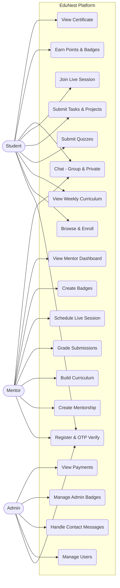

## 4.2 Class Diagram (Core Domain)
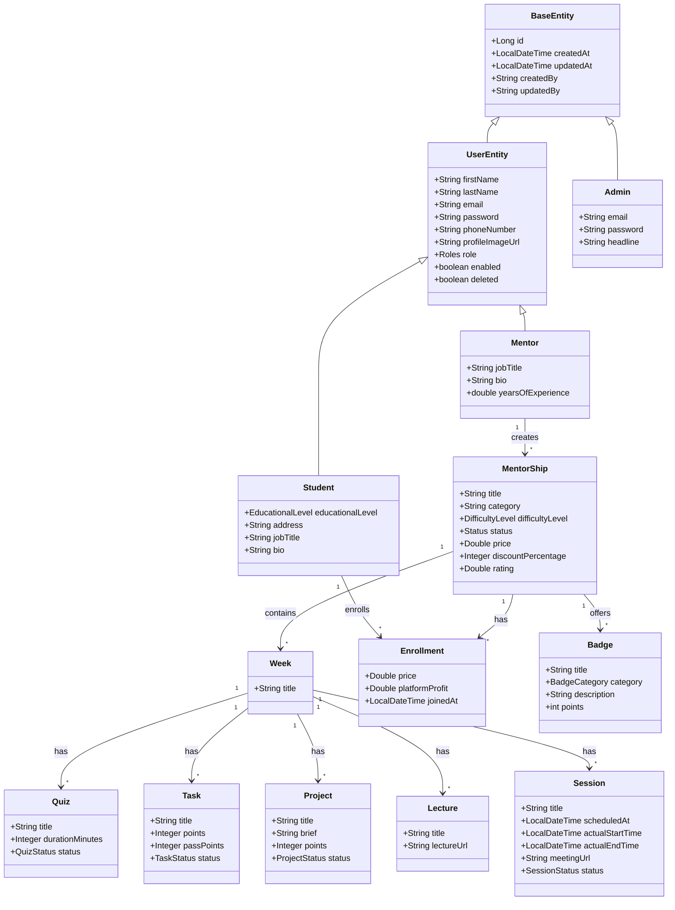

## 4.3 Sequence Diagram: Registration & OTP
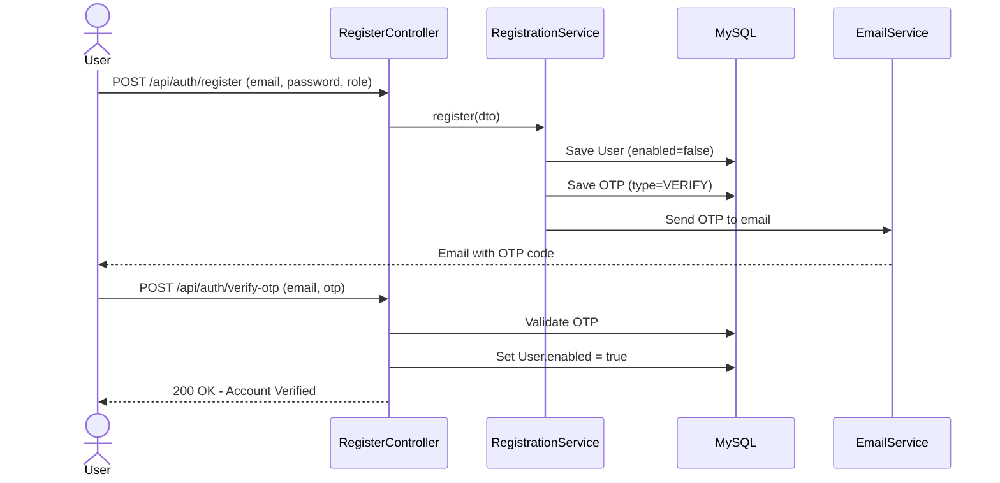

## 4.4 Sequence Diagram: Login & JWT Auth
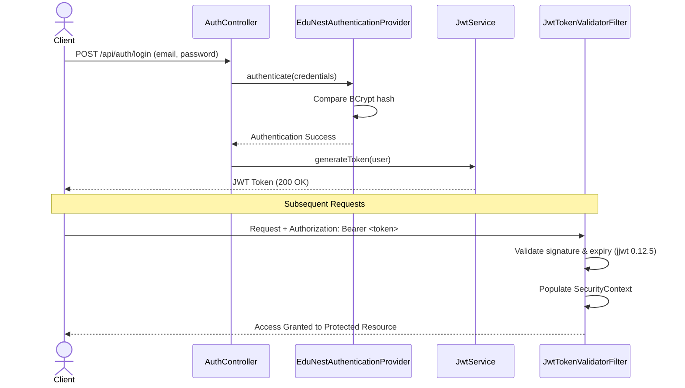

## 4.5 Sequence Diagram: Project Submission Flow
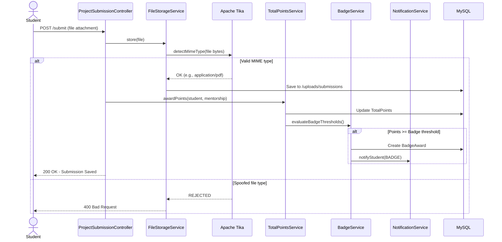

## 4.6 Sequence Diagram: Mentorship Creation & Curriculum Building
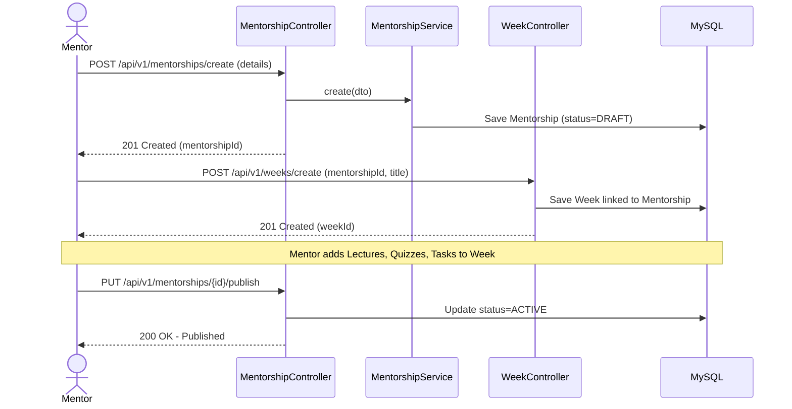

## 4.7 Sequence Diagram: Live Session Flow
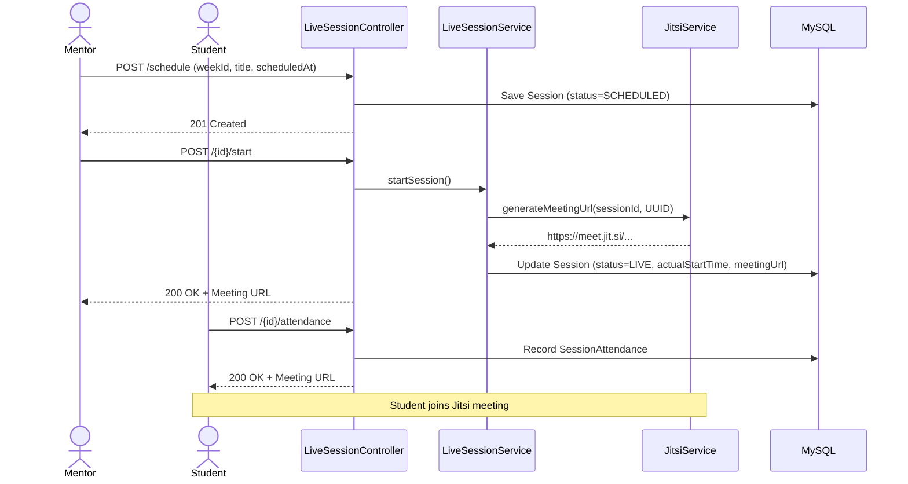

## 4.8 Sequence Diagram: Real-Time Chat
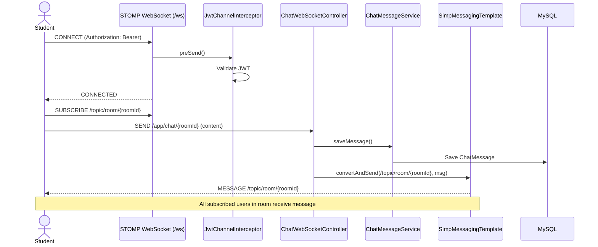

## 4.9 Sequence Diagram: Certificate Generation
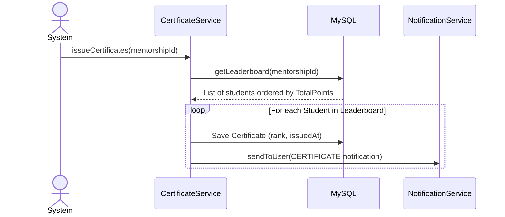

## 4.10 Sequence Diagram: Student Mentorship Enrollment
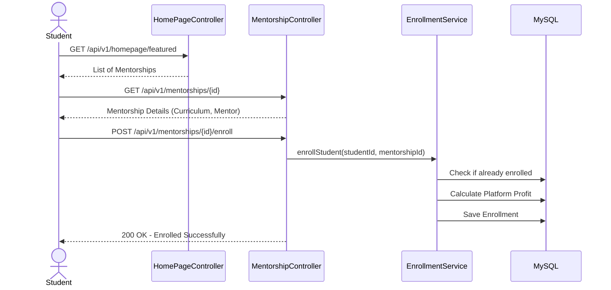

## 4.11 Sequence Diagram: Quiz Submission & Auto-Grading
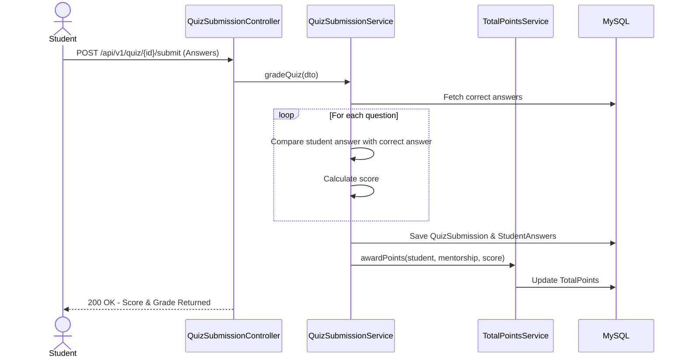

## 4.12 Sequence Diagram: Mentor Grading Submissions
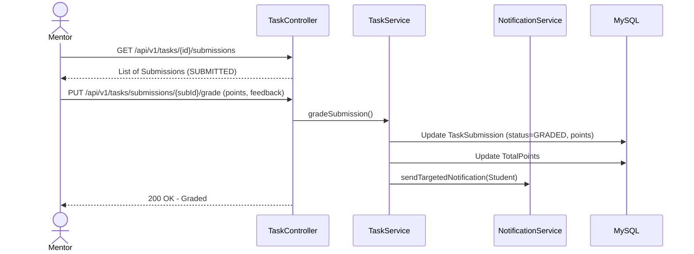

## 4.13 Sequence Diagram: Notifications Broadcast
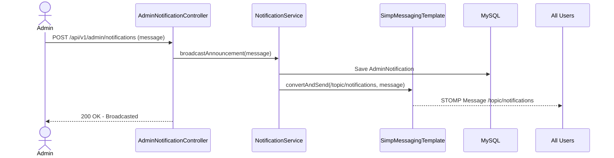

## 4.14 Sequence Diagram: Student Profile Update & Skills Addition
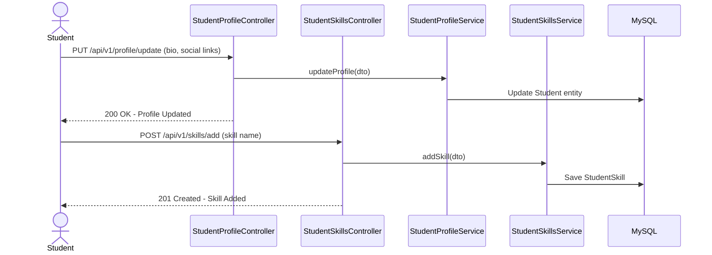

## 4.15 Sequence Diagram: Mentorship Review & Rating
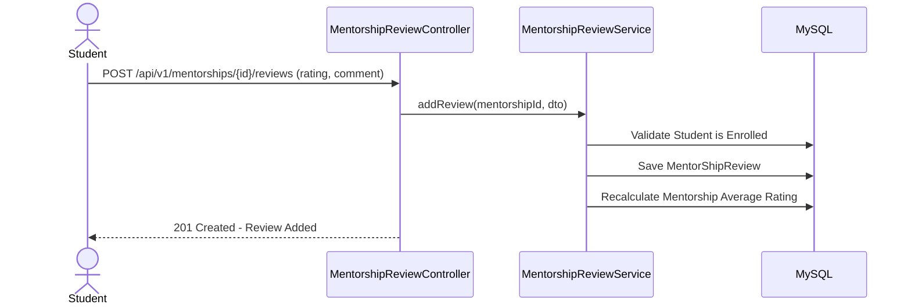

## 4.16 Sequence Diagram: Contact Us & Admin Reply
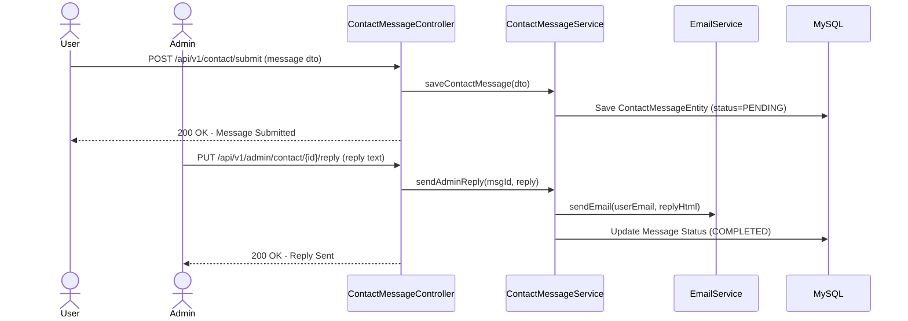

## 4.17 Sequence Diagram: Student My Learning & Progress Tracking
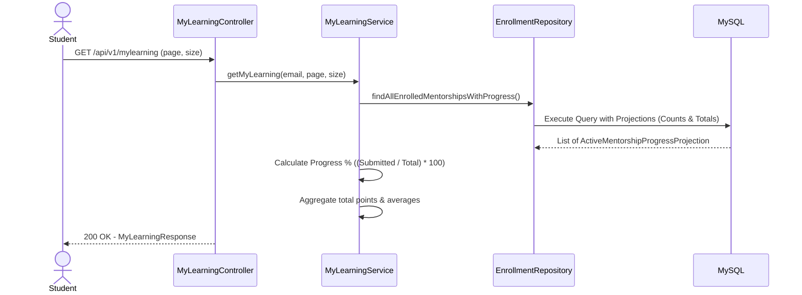

## 4.18 Sequence Diagram: Mentor Dashboard Retrieval
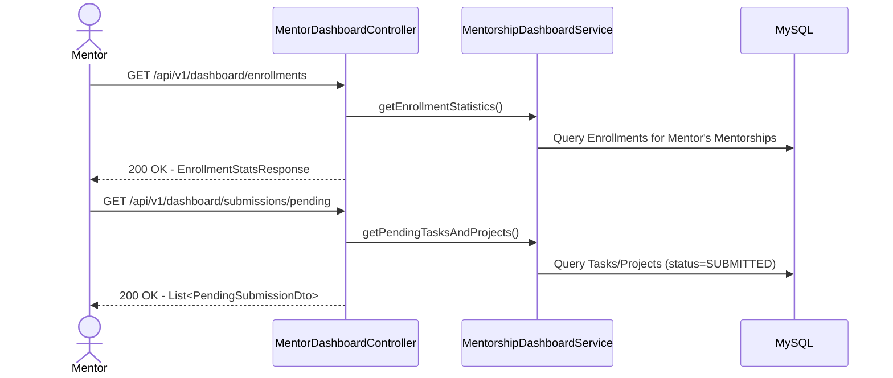

## 4.19 Sequence Diagram: Account Password Reset (OTP)
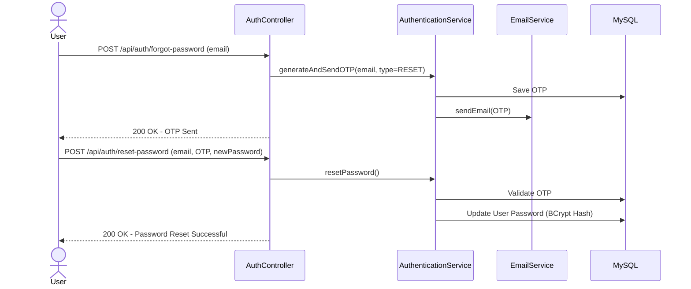

## 4.20 Sequence Diagram: Homepage Catalog & Filtering
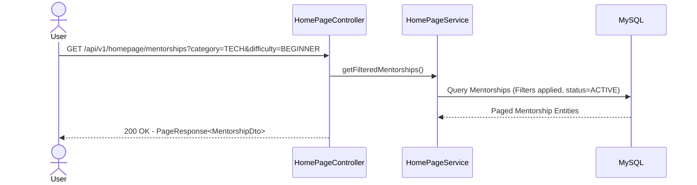

## 4.21 Sequence Diagram: Task Submission & Mentor Grading (Full Flow)
```mermaid
sequenceDiagram
    actor Student
    actor Mentor
    participant TaskCtrl as TaskSubmissionController
    participant FileSvc as FileStorageService
    participant Tika as Apache Tika
    participant TaskSvc as TaskSubmissionService
    participant PointsSvc as TotalPointsService
    participant NotifySvc as NotificationService
    participant DB as MySQL

    Student->>TaskCtrl: POST /api/v1/tasks/{id}/submit (file)
    TaskCtrl->>FileSvc: store(file)
    FileSvc->>Tika: detectMimeType(file bytes)
    Tika-->>FileSvc: OK - Valid MIME
    FileSvc->>DB: Save to /uploads/submissions
    TaskCtrl->>DB: Save TaskSubmission (status=SUBMITTED)
    TaskCtrl-->>Student: 200 OK - Submitted
    
    Mentor->>TaskCtrl: PUT /api/v1/tasks/submissions/{subId}/grade (points, feedback)
    TaskCtrl->>TaskSvc: gradeSubmission()
    TaskSvc->>DB: Update TaskSubmission (status=GRADED, points, feedback)
    TaskSvc->>PointsSvc: awardPoints(student, mentorship, points)
    PointsSvc->>DB: Update TotalPoints
    TaskSvc->>NotifySvc: sendToUser(TASK notification)
    TaskCtrl-->>Mentor: 200 OK - Graded
```

## 4.22 Sequence Diagram: Admin Badge Award & PDF Certificate Email
```mermaid
sequenceDiagram
    actor Admin
    participant BadgeCtrl as AdminBadgeController
    participant BadgeSvc as AdminBadgeService
    participant PdfSvc as BadgePdfGeneratorService
    participant NotifySvc as NotificationService
    participant Mail as EmailService
    participant DB as MySQL

    Admin->>BadgeCtrl: POST /api/v1/admin/badges/award (userId, badgeId, note)
    BadgeCtrl->>BadgeSvc: awardBadgeToUser(userId, badgeId, note)
    BadgeSvc->>DB: Validate User & Badge exist
    BadgeSvc->>DB: Check not already awarded
    BadgeSvc->>DB: Save UserAdminBadge
    BadgeSvc->>NotifySvc: sendToUserByEmail(BADGE notification)
    BadgeSvc->>PdfSvc: generateBadgeCertificate(name, badge, type, note)
    PdfSvc-->>BadgeSvc: PDF ByteArrayOutputStream
    BadgeSvc->>Mail: sendEmailWithAttachment(email, html, PDF)
    BadgeCtrl-->>Admin: 200 OK - Badge Awarded
```

## 4.23 Sequence Diagram: Admin Dashboard & Platform Analytics
```mermaid
sequenceDiagram
    actor Admin
    participant DashCtrl as AdminDashboardController
    participant DashSvc as Dashboard
    participant PaySvc as Payments
    participant DB as MySQL

    Admin->>DashCtrl: GET /api/v1/admin/dashboard
    DashCtrl->>DashSvc: getPlatformStatistics()
    DashSvc->>DB: Count Users by Role
    DashSvc->>DB: Count Active Mentorships
    DashSvc->>DB: Get Monthly User Growth
    DashCtrl-->>Admin: 200 OK - DashboardResponse
    
    Admin->>DashCtrl: GET /api/v1/admin/payments
    DashCtrl->>PaySvc: getPaymentsOverview()
    PaySvc->>DB: Sum platformProfit from Enrollments
    DashCtrl-->>Admin: 200 OK - PaymentsResponse
```

## 4.24 Sequence Diagram: Student Week View & Content Retrieval
```mermaid
sequenceDiagram
    actor Student
    participant WeekCtrl as StudentWeekController
    participant WeekSvc as StudentWeekService
    participant DB as MySQL

    Student->>WeekCtrl: GET /api/v1/weeks/{mentorshipId}/contents
    WeekCtrl->>WeekSvc: getMentorshipWeeksWithContents(mentorshipId, email)
    WeekSvc->>DB: Verify Enrollment
    WeekSvc->>DB: Fetch Weeks for Mentorship
    WeekSvc->>DB: Batch Fetch Sessions, Lectures, Tasks, Quizzes, Projects
    WeekSvc->>DB: Batch Fetch Student Completions (attendance, submissions)
    WeekSvc->>WeekSvc: Build items list with completed status
    WeekCtrl-->>Student: 200 OK - MentorshipWeeksWithContentsResponse
```

## 4.25 Sequence Diagram: Student Achievements & Portfolio
```mermaid
sequenceDiagram
    actor Student
    participant AchCtrl as StudentAchievementController
    participant AchSvc as StudentAchievementService
    participant DB as MySQL

    Student->>AchCtrl: GET /api/v1/achievements
    AchCtrl->>AchSvc: getAchievements(badgesPage, projectsPage)
    AchSvc->>DB: Fetch BadgeAwards (ordered by date)
    AchSvc->>DB: Fetch ProjectSubmissions (status=GRADED)
    AchSvc->>AchSvc: Map to BadgeAchievementResponse + ProjectAchievementResponse
    AchCtrl-->>Student: 200 OK - StudentAchievementResponse
```

## 4.26 Sequence Diagram: Account Settings (Change Email & Delete Account)
```mermaid
sequenceDiagram
    actor User
    participant SetCtrl as SettingsController
    participant SetSvc as SettingsService
    participant Mail as EmailService
    participant DB as MySQL

    Note over User,DB: Change Email Flow
    User->>SetCtrl: POST /api/v1/account/change-email (newEmail)
    SetCtrl->>SetSvc: requestChangeEmail(newEmail)
    SetSvc->>DB: Validate email not in use
    SetSvc->>DB: Save OTP (type=CHANGE_EMAIL, pendingEmail)
    SetSvc->>Mail: Send OTP to new email
    SetCtrl-->>User: 200 OK - OTP Sent
    
    User->>SetCtrl: POST /api/v1/account/confirm-change-email (otpCode)
    SetCtrl->>SetSvc: confirmChangeEmail(otpCode)
    SetSvc->>DB: Validate OTP & Update User Email
    SetCtrl-->>User: 200 OK - Email Changed

    Note over User,DB: Delete Account Flow
    User->>SetCtrl: POST /api/v1/account/delete
    SetCtrl->>SetSvc: deleteAccount()
    SetSvc->>DB: Save OTP (type=DELETE)
    SetSvc->>Mail: Send Confirmation OTP
    SetCtrl-->>User: 200 OK - OTP Sent
    
    User->>SetCtrl: POST /api/v1/account/confirm-delete (otpCode)
    SetCtrl->>SetSvc: confirmDeleteAccount(otpCode)
    SetSvc->>DB: Set user.deleted = true (Soft Delete)
    SetCtrl-->>User: 200 OK - Account Deleted
```

## 4.27 Sequence Diagram: Mentorship Details & Enrollment Status
```mermaid
sequenceDiagram
    actor User
    participant OverviewCtrl as MentorshipOverviewController
    participant OverviewSvc as MentorshipOverviewService
    participant DB as MySQL

    User->>OverviewCtrl: GET /api/v1/mentorships/{id}/details
    OverviewCtrl->>OverviewSvc: getMentorshipWithEnrollmentStatus(id, email)
    OverviewSvc->>DB: Check Enrollment Status
    
    alt Not Enrolled
        OverviewSvc->>DB: Fetch Full Details (price, discount, mentor info)
        OverviewSvc->>DB: Fetch Tags & What Will Learn
        OverviewSvc->>DB: Fetch Top Mentorships by Same Mentor
        OverviewCtrl-->>User: 200 OK - BeforeEnrollData
    else Already Enrolled
        OverviewSvc->>DB: Fetch Enrolled View (progress, upcoming items)
        OverviewSvc->>DB: Fetch Tags & What Will Learn
        OverviewCtrl-->>User: 200 OK - AfterEnrollData
    end
```

## 4.28 Activity Diagram: Student Enrollment & Learning Journey
```mermaid
flowchart TD
  A([Start]) --> B[Student Logs In]
  B --> C[Browse Mentorship Catalog]
  C --> D[Select Mentorship]
  D --> E[Enroll - Enrollment record created]
  E --> F[Auto-added to Cohort Chat Room]
  F --> G[View Week 1 Curriculum]
  G --> H{Week Activities}
  H --> I[Watch Lectures]
  H --> J[Take Quiz - Auto-Graded]
  H --> K[Submit Task/Project Files]
  H --> L[Join Live Session via Jitsi]
  I --> M[Earn Points]
  J --> M
  K --> M
  M --> N{Badge Threshold Met?}
  N -- Yes --> O[Badge Awarded + Notification]
  N -- No --> P[Continue to Next Week]
  O --> P
  P --> Q{All Weeks Completed?}
  Q -- No --> G
  Q -- Yes --> R[Certificate Generated - PDF via iText7]
  R --> S([End])
```

## 4.29 Entity Relationship Diagram (ERD)
```mermaid
erDiagram
  USERS ||--o{ STUDENTS : "JOINED inheritance"
  USERS ||--o{ MENTORS : "JOINED inheritance"
  USERS ||--o{ SOCIAL_MEDIA : "has"
  USERS ||--o{ CHAT_ROOMS : "creates"
  MENTORS ||--o{ MENTORSHIP : "creates"
  MENTORSHIP ||--o{ WEEKS : "contains"
  MENTORSHIP ||--o{ ENROLLMENTS : "has"
  MENTORSHIP ||--o{ REVIEWS : "receives"
  MENTORSHIP ||--o{ BADGES : "offers"
  MENTORSHIP ||--o{ TOTAL_POINTS : "tracks"
  MENTORSHIP ||--o{ CERTIFICATES : "issues"
  MENTORSHIP ||--o{ CHAT_ROOMS : "has"
  WEEKS ||--o{ LECTURES : "contains"
  WEEKS ||--o{ QUIZZES : "contains"
  WEEKS ||--o{ TASKS : "contains"
  WEEKS ||--o{ PROJECTS : "contains"
  WEEKS ||--o{ SESSIONS : "contains"
  QUIZZES ||--o{ QUESTIONS : "has"
  QUIZZES ||--o{ QUIZ_SUBMISSIONS : "receives"
  QUIZ_SUBMISSIONS ||--o{ STUDENT_ANSWERS : "contains"
  TASKS ||--o{ TASK_SUBMISSIONS : "receives"
  PROJECTS ||--o{ PROJECT_SUBMISSIONS : "receives"
  SESSIONS ||--o{ SESSION_ATTENDANCE : "tracks"
  STUDENTS ||--o{ ENROLLMENTS : "enrolls"
  STUDENTS ||--o{ BADGE_AWARDS : "earns"
  STUDENTS ||--o{ STUDENT_SKILLS : "has"
  STUDENTS ||--o{ CERTIFICATES : "receives"
  CHAT_ROOMS ||--o{ CHAT_ROOM_MEMBERS : "has"
  CHAT_ROOMS ||--o{ CHAT_MESSAGES : "contains"
  CONVERSATIONS ||--o{ MESSAGES : "contains"
```

## 4.30 Data Flow Diagram (DFD Level 0)
```mermaid
flowchart LR
  S((Student))
  M((Mentor))
  A((Admin))
  System[EduNest Backend]

  S -- "Register, Enroll, Submit, Chat" --> System
  System -- "Curriculum, Grades, Badges, Certificates" --> S

  M -- "Create Mentorship, Grade, Schedule Sessions" --> System
  System -- "Enrollments, Revenue, Submissions" --> M

  A -- "Manage Users, Admin Badges, Contact Messages" --> System
  System -- "Analytics, Platform Stats" --> A
```

## 4.31 State Diagram: Mentorship Lifecycle
```mermaid
stateDiagram-v2
  [*] --> DRAFT
  DRAFT --> ACTIVE : Mentor Publishes
  ACTIVE --> COMPLETED : All weeks finished
  COMPLETED --> [*]
```

## 4.32 State Diagram: Live Session Lifecycle
```mermaid
stateDiagram-v2
  [*] --> SCHEDULED
  SCHEDULED --> LIVE : Mentor starts session
  LIVE --> ENDED : Session ends
  ENDED --> [*]
```

## 4.33 State Diagram: Task/Quiz Status
```mermaid
stateDiagram-v2
  [*] --> DRAFT
  DRAFT --> PUBLISHED : Mentor publishes
  PUBLISHED --> CLOSED : Deadline passed
  CLOSED --> [*]
```
<div style="page-break-after: always;"></div>

# Chapter 5: Database Design

## 5.1 Schema Overview
The database uses **MySQL 8** with a highly normalized relational schema. The system applies **JOINED Inheritance** for users (UserEntity → Student / Mentor), ensuring strict referential integrity while isolating role-specific data in separate tables.

## 5.2 Base Entity (Auditing)
Every table in the system inherits from `BaseEntity`, a `@MappedSuperclass` that provides:
- `id` (auto-generated primary key)
- `createdAt` (auto-populated via `@CreationTimestamp`)
- `updatedAt` (auto-populated via `@UpdateTimestamp`)
- `createdBy` (auto-populated via `@CreatedBy` + `AuditorAwareImpl`)
- `updatedBy` (auto-populated via `@LastModifiedBy`)

This ensures full audit traceability on every single record in the database without any manual effort from the developer.

## 5.3 Key Tables and Relationships

| Table                 | Key Columns                                                                                                                            | Relationships                                                                                                                 |
| --------------------- | -------------------------------------------------------------------------------------------------------------------------------------- | ----------------------------------------------------------------------------------------------------------------------------- |
| `users`               | firstName, lastName, email, password, role_id, enabled, deleted                                                                        | Parent to `students`, `mentors`. Has many `social_media`, `chat_rooms`                                                        |
| `students`            | student_id (FK to users), educationalLevel, address, jobTitle, bio                                                                     | Has many `enrollments`, `reviews`, `badge_awards`, `student_skills`                                                           |
| `mentors`             | mentor_id (FK to users), jobTitle, bio, yearsOfExperience                                                                              | Has many `mentorships`                                                                                                        |
| `roles`               | name (STUDENT, MENTOR, ADMIN)                                                                                                          | Referenced by `users.role_id`                                                                                                 |
| `admin`               | email, password, firstName, lastName, headline, role                                                                                   | Separate from UserEntity hierarchy                                                                                            |
| `mentorship`          | title, subtitle, description, category, rating, difficultyLevel, status, price, discountPercentage, coverImageUrl, duration, mentor_id | Has many `weeks`, `tags`, `what_will_learn`, `enrollments`, `reviews`, `chat_rooms`, `total_points`, `badges`, `certificates` |
| `weeks`               | title, mentorship_id                                                                                                                   | Has many `lectures`, `quizzes`, `tasks`, `projects`, `sessions`                                                               |
| `lectures`            | lecture_title, lecture_url, week_id                                                                                                    | Belongs to `weeks`                                                                                                            |
| `quiz`                | title, description, durationMinutes, status, week_id                                                                                   | Has many `questions`, `quiz_submissions`                                                                                      |
| `questions`           | quiz_id, choices A/B/C/D, correctAnswer                                                                                                | Belongs to `quiz`                                                                                                             |
| `quiz_submissions`    | quiz_id, student_id                                                                                                                    | Has many `student_answers`                                                                                                    |
| `tasks`               | task_title, task_description, task_points, task_pass_points, task_estimated_minutes, task_status, task_due_at, week_id                 | Has many `task_submissions`                                                                                                   |
| `task_submissions`    | task_id, student_id, status (SUBMITTED/GRADED)                                                                                         | Belongs to `tasks`                                                                                                            |
| `projects`            | project_title, project_brief, project_goal, project_start_at, project_end_at, project_points, project_status, week_id                  | Has many `project_submissions`                                                                                                |
| `sessions`            | title, scheduledAt, actualStartTime, actualEndTime, meetingUrl, status, week_id                                                        | Has many `session_attendance`, `session_attendance_results`                                                                   |
| `enrollments`         | student_id, mentorship_id, price, platformProfit, joinedAt                                                                             | Index on (student_id, mentorship_id)                                                                                          |
| `badges`              | title, category, description, points, mentorship_id                                                                                    | Has many `badge_awards`                                                                                                       |
| `total_points`        | student_id, mentorship_id, totalPoints                                                                                                 | Unique constraint on (student_id, mentorship_id)                                                                              |
| `certificates`        | student_id, mentorship_id, rank, issuedAt                                                                                              | Unique constraint on (student_id, mentorship_id)                                                                              |
| `chat_rooms`          | mentorship_id, creator_id                                                                                                              | Has many `chat_room_members`, `chat_messages`                                                                                 |
| `conversations`       | user1, user2                                                                                                                           | Has many `messages`                                                                                                           |
| `contact_message`     | name, email, phone, message, status (PENDING/UNDER_REVIEW/COMPLETED)                                                                   | Public contact form                                                                                                           |
| `admin_badges`        | type (TOP_MENTOR, ACADEMIC_EXCELLENCE, etc.)                                                                                           | Admin-level badges                                                                                                            |
| `user_admin_badges`   | user_id, admin_badge_id                                                                                                                | Tracks user-to-admin-badge assignments                                                                                        |
| `notifications`       | type, message                                                                                                                          | Base notification entity                                                                                                      |
| `user_notifications`  | user_id, notification_id                                                                                                               | Targeted notifications                                                                                                        |
| `admin_notifications` | notification_id                                                                                                                        | Platform-wide admin broadcasts                                                                                                |

## 5.4 Database Indexes
Explicit indexes are defined for performance on frequently queried columns:
- `idx_mentorship_mentor_id` on `mentorship(mentor_id)`
- `idx_mentorship_status` on `mentorship(status)`
- `idx_enrollments_student_mentorship` on `enrollments(student_id, mentorship_id)`
- `idx_quiz_week_id` on `quiz(week_id)`
- `idx_task_week_id` on `tasks(week_id)`
- `idx_project_week_id` on `projects(week_id)`
- `idx_lectures_week_id` on `lectures(week_id)`
- `idx_session_week_id` on `sessions(week_id)`

## 5.5 Data Integrity Mechanisms
- **Soft Deletion:** `UserEntity.deleted` boolean flag preserves relational history when accounts are deactivated.
- **Unique Constraints:** Enforced on `users.email`, `certificates(student_id, mentorship_id)`, `total_points(student_id, mentorship_id)`.
- **Cascade Operations:** `CascadeType.ALL` with `orphanRemoval = true` on parent-child relationships (e.g., deleting a Week cascades to its Lectures, Quizzes, Tasks, Projects).
- **Lazy Loading:** All `@ManyToOne` and `@OneToMany` relations use `FetchType.LAZY` to prevent N+1 query issues.

<div style="page-break-after: always;"></div>

# Chapter 6: System Architecture

## 6.1 Architectural Style
EduNest follows a **Modular Monolith** architecture with **Domain-Driven Packaging**. The codebase is organized by business domain rather than by technical layer:

```
com.example.gradproj.EduNest/
├── controller/
│   ├── auth/          (AuthController)
│   ├── mentorShip/    (mentorShipControllers)
│   ├── quiz/          (QuizController, QuestionController, QuizSubmissionController)
│   ├── tasks/         (TaskController, TaskSubmissionController)
│   ├── projects/      (ProjectController, ProjectSubmissionController)
│   ├── livesession/   (LiveSessionController)
│   ├── chat/          (chatRestControllers, ChatWebSocketController, ConversationRestControllers, ConversationWebSocketControllers)
│   ├── badges/        (BadgeController, BadgeAwardController)
│   ├── weeks/         (WeekController, StudentWeekController)
│   ├── lecture/       (LectureController)
│   ├── profile/       (StudentProfileController, MentorProfileInfoController, MentorProfileForStudent, MentorViewStudentProfileController)
│   ├── notification/  (NotificationController)
│   ├── skill/         (StudentSkillsController)
│   ├── homepage/      (HomePageController)
│   ├── admin/         (AdminController, AdminBadgeController, AdminDashboardController, AdminPaymentsController, AdminUserDirectoryController, AdminNotificationController, AdminProfileAndSettingsController)
│   ├── MentorDashboard/ (MentorDashboardController)
│   ├── register/      (UserManagementController)
│   ├── studentAchievementController/ (StudentAchievementController)
│   ├── studentCertificates/ (StudentCertificatesController)
│   ├── studentMentorship/ (MentorshipOverviewController)
│   ├── mylearning/    (MyLearningController)
│   ├── contactus/     (ContactMessageController)
│   ├── account/       (SettingsController)
│   └── file/          (FileController)
├── service/           (mirrors controller structure)
├── repository/        (Spring Data JPA interfaces + projections)
├── entity/            (JPA entities per domain)
├── dto/               (request/response DTOs per domain)
├── enums/             (domain-specific enumerations)
├── config/            (security, WebSocket, Swagger, auth, roles seeder)
├── filters/           (JwtTokenGeneratorFilter, JwtTokenValidatorFilter)
├── exception/         (GlobalExceptionHandler)
├── auditing/          (AuditorAwareImpl)
├── annotation/        (custom annotations)
├── validation/        (PasswordMatches, PasswordMatchesValidator)
├── security/          (CurrentUserProvider)
└── util/utils/        (Constants, SystemUtils, FileResponseBuilder)
```

## 6.2 Layered Decomposition
```
┌──────────────────────────────────────────────────────────────┐
│  Controllers (42 REST + 2 WebSocket STOMP endpoints)         │
├──────────────────────────────────────────────────────────────┤
│  Services (business logic, @Transactional, orchestration)    │
├──────────────────────────────────────────────────────────────┤
│  Repositories (Spring Data JPA + custom projections)         │
├──────────────────────────────────────────────────────────────┤
│  Entities (JPA @Entity, JOINED inheritance, BaseEntity)      │
├──────────────────────────────────────────────────────────────┤
│  MySQL 8 Database                                            │
└──────────────────────────────────────────────────────────────┘

Cross-cutting Concerns:
  • JwtTokenGeneratorFilter / JwtTokenValidatorFilter
  • JwtHandshakeInterceptor / JwtChannelInterceptor (WebSocket)
  • GlobalExceptionHandler (@ControllerAdvice)
  • AuditorAwareImpl (auto-populates createdBy/updatedBy)
  • FileStorageService + Apache Tika (secure uploads)
  • EmailService (OTP via SMTP)
```

## 6.3 API Endpoint Map

| Domain               | Base Path                | Key Operations                                                                   |
| -------------------- | ------------------------ | -------------------------------------------------------------------------------- |
| **Auth**             | `/api/auth/`             | `POST /login`, `POST /register`, `POST /verify-otp`                              |
| **Mentorships**      | `/api/v1/mentorships/`   | `GET /browse`, `POST /create`, `POST /{id}/enroll`, `PUT /publish`               |
| **Weeks**            | `/api/v1/weeks/`         | `POST /create`, `GET /{mentorshipId}/weeks`                                      |
| **Lectures**         | `/api/v1/lectures/`      | `POST /create`, `GET /{weekId}/lectures`                                         |
| **Quizzes**          | `/api/v1/quiz/`          | `POST /create`, `POST /{id}/submit`, `GET /{id}/results`                         |
| **Tasks**            | `/api/v1/tasks/`         | `POST /create`, `POST /{id}/submit`, `PUT /{id}/grade`                           |
| **Projects**         | `/api/v1/projects/`      | `POST /create`, `POST /{id}/submit`, `PUT /{id}/grade`                           |
| **Live Sessions**    | `/api/v1/livesession/`   | `POST /schedule`, `POST /{id}/start`, `POST /{id}/attendance`                    |
| **Chat**             | `/api/v1/chat/` + `/ws/` | `GET /rooms`, `GET /messages`, STOMP subscribe/send                              |
| **Conversations**    | `/api/v1/conversations/` | `POST /create`, `GET /messages`                                                  |
| **Badges**           | `/api/v1/badges/`        | `POST /create`, `GET /{mentorshipId}/badges`, `GET /leaderboard`                 |
| **Profile**          | `/api/v1/profile/`       | `GET /me`, `PUT /update`, `GET /mentor/{id}`                                     |
| **Skills**           | `/api/v1/skills/`        | `POST /add`, `DELETE /{id}`                                                      |
| **Certificates**     | `/api/v1/certificates/`  | `GET /my-certificates`, `GET /{id}/download`                                     |
| **Notifications**    | `/api/v1/notifications/` | `GET /`, `PUT /{id}/read`                                                        |
| **Homepage**         | `/api/v1/homepage/`      | `GET /featured`, `GET /categories`                                               |
| **Admin**            | `/api/v1/admin/`         | `GET /users`, `POST /badges`, `GET /contacts`, `GET /payments`, `GET /dashboard` |
| **Mentor Dashboard** | `/api/v1/dashboard/`     | `GET /enrollments`, `GET /revenue`, `GET /submissions`                           |
| **Contact Us**       | `/api/v1/contact/`       | `POST /submit`                                                                   |
| **Swagger UI**       | `/swagger-ui.html`       | Interactive API docs                                                             |
<div style="page-break-after: always;"></div>

# Chapter 7: Technologies Used

| Technology                  | Version      | Purpose in EduNest                                                                 |
| --------------------------- | ------------ | ---------------------------------------------------------------------------------- |
| **Java**                    | 21           | Primary backend language with modern syntax and LTS support                        |
| **Spring Boot**             | 3.5.7        | Core framework — auto-configuration, embedded Tomcat, dependency injection         |
| **Spring Security**         | 6            | Authentication & authorization framework (filter chain, RBAC)                      |
| **jjwt**                    | 0.12.5       | JWT token generation, signing, and validation (jjwt-api, jjwt-impl, jjwt-jackson)  |
| **Spring Data JPA**         | (via Boot)   | Repository abstraction over Hibernate ORM for MySQL queries                        |
| **Hibernate**               | (via Boot)   | JPA implementation — entity mapping, JOINED inheritance, lazy loading              |
| **MySQL**                   | 8.0.33       | Relational database — ACID compliance, indexing, foreign keys                      |
| **Spring WebSocket**        | (via Boot)   | STOMP protocol for real-time bidirectional chat and notifications                  |
| **Apache Tika**             | 2.9.2        | File MIME-type validation via magic bytes — prevents spoofed uploads               |
| **iText7**                  | 7.2.5        | Programmatic PDF generation for completion certificates                            |
| **Jitsi Meet**              | (external)   | Free, open-source video conferencing — meeting URL generation                      |
| **Spring Mail**             | (via Boot)   | SMTP integration for OTP emails and notification emails                            |
| **springdoc-openapi**       | 2.7.0        | Auto-generated Swagger UI for interactive API documentation                        |
| **Thymeleaf**               | (via Boot)   | Server-side template engine for email HTML templates                               |
| **Lombok**                  | (via Boot)   | Boilerplate reduction: `@Getter`, `@Setter`, `@SuperBuilder`, `@NoArgsConstructor` |
| **Jakarta Bean Validation** | (via Boot)   | Declarative input validation: `@Valid`, `@NotBlank`, `@Email`, `@Min`, `@Max`      |
| **Maven**                   | (wrapper)    | Build tool, dependency management, fat-jar packaging                               |
| **Docker**                  | (Dockerfile) | Containerization for portable deployment                                           |

<div style="page-break-after: always;"></div>

# Chapter 8: UI/UX Design

This chapter presents the user interface design of EduNest, organized by feature area. Each section describes the screen's purpose and indicates where screenshots should be inserted.

## 8.1 Authentication & Onboarding

The authentication flow provides a clean, modern login and registration experience with email-based OTP verification.

> **Screenshot:** Login Page — email/password fields, role selection (Student/Mentor)
> 

> **Screenshot:** Registration Page — multi-step form with user details
> 

> **Screenshot:** OTP Verification Screen — 6-digit code input with countdown timer
> 

## 8.2 Homepage & Mentorship Discovery

The homepage serves as the primary entry point, displaying featured mentorships with rich cards showing cover images, ratings, pricing, and category tags. Students can filter by category, difficulty level, and rating.

> **Screenshot:** Student Homepage — Mentorship catalog cards with ratings, tags, and prices
> 

> **Screenshot:** Search & Filter Panel — Category, difficulty level, and rating filters
> 

## 8.3 Mentorship Detail Page

Before enrollment, students see the full mentorship overview: description, curriculum preview, "What You Will Learn" items, mentor profile, pricing with discounts, and reviews from previous students.

> **Screenshot:** Mentorship Detail Page (Before Enroll) — description, tags, What Will Learn, Enroll button, price
> 

> **Screenshot:** Mentorship Detail Page (After Enroll) — progress bar, upcoming items, curriculum access
> 

## 8.4 Student Weekly Curriculum View

Once enrolled, students access the structured week-by-week curriculum. Each week displays its content items (Lectures, Quizzes, Tasks, Projects, Sessions) with completion status indicators.

> **Screenshot:** Student Weekly View — Weeks list with content items and completion checkmarks
> 

> **Screenshot:** Lecture View — Video player with lecture title
> 

## 8.5 Quizzes & Assessments

The quiz interface presents MCQ questions (A/B/C/D) with a countdown timer. Auto-grading provides immediate score feedback upon submission.

> **Screenshot:** Quiz Taking Interface — MCQ with A/B/C/D choices and timer
> 

> **Screenshot:** Quiz Results — Score display, correct/incorrect breakdown
> 

## 8.6 Task & Project Submissions

Students upload task and project files through a clean submission form. Files are validated via Apache Tika for security. Mentors provide manual grades and feedback.

> **Screenshot:** Task Submission Page — File upload, task description, due date, points
> 

> **Screenshot:** Project Submission Page — Project brief, goals, file upload, deadline
> 

> **Screenshot:** Graded Submission View — Mentor feedback, score, status
> 

## 8.7 Live Sessions (Jitsi Meet)

Mentors schedule and start live sessions with auto-generated Jitsi Meet links. Students join directly from the platform with automatic attendance tracking.

> **Screenshot:** Live Session Page — Scheduled sessions list, Join button, Jitsi meeting embedded or linked
> 

## 8.8 Real-Time Chat

Group chat rooms are created per mentorship cohort. Private 1-to-1 conversations are also supported. All messages are persisted and delivered via WebSocket STOMP.

> **Screenshot:** Group Chat Room — Messages, member list, real-time updates
> 

> **Screenshot:** Private Conversation — Direct messaging between Student and Mentor
> 

## 8.9 Gamification (Badges, Points, Leaderboard)

Students earn points through quizzes, tasks, and projects. Badges are unlocked when point thresholds are reached. The leaderboard ranks all students within a mentorship cohort.

> **Screenshot:** Badge Collection — Earned badges displayed with categories and descriptions
> 

> **Screenshot:** Leaderboard — Ranked students with avatars, names, and point totals
> 

## 8.10 Certificates

Upon mentorship completion, a PDF certificate is auto-generated via iText7 containing the student's name, mentorship title, cohort rank, and issue date.

> **Screenshot:** Certificates List — Student's earned certificates with download buttons
> 

> **Screenshot:** Generated PDF Certificate — Styled certificate with rank and date
> 

## 8.11 Student Profile & Achievements

Public profiles aggregate skills, social links (GitHub, LinkedIn, Facebook), earned badges, certificates, and project submissions — creating a dynamic professional portfolio.

> **Screenshot:** Student Profile — Bio, skills, social links, badges, certificates
> 

> **Screenshot:** Student Achievements Page — Badges and graded project submissions
> 

## 8.12 My Learning Dashboard

Students view all their enrolled mentorships with progress percentages, total points, and completion status at a glance.

> **Screenshot:** My Learning Page — Enrolled mentorships cards with progress bars and stats
> 

## 8.13 Mentor Dashboard

Mentors access enrollment analytics, revenue/commission tracking, and pending submission queues from their dedicated dashboard.

> **Screenshot:** Mentor Dashboard — Enrollment stats, revenue chart, pending submissions count
> 

## 8.14 Mentor Curriculum Builder

Mentors create and manage week-by-week curricula by adding Lectures, Quizzes, Tasks, and Projects through an intuitive builder interface.

> **Screenshot:** Mentor Curriculum Builder — Adding Weeks, Lectures, Quizzes, Tasks
> 

> **Screenshot:** Mentor Mentorship Creation Form — Title, category, price, tags, cover image
> 

## 8.15 Account Settings

Users manage their accounts: change email (with OTP verification), change password, deactivate account, or request account deletion (soft delete).

> **Screenshot:** Account Settings Page — Change email, change password, delete account options
> 

## 8.16 Admin Console

Administrators manage the entire platform: user directory, admin badges, contact message handling, payments overview, and platform analytics.

> **Screenshot:** Admin User Directory — Searchable user list with roles and status
> 

> **Screenshot:** Admin Badge Management — Create/assign platform-wide badges
> 

> **Screenshot:** Admin Contact Messages — Status workflow (PENDING → UNDER_REVIEW → COMPLETED)
> 

> **Screenshot:** Admin Dashboard — Platform analytics, user growth charts, revenue
> 

## 8.17 Notifications

Multi-type notifications keep users informed about quizzes, sessions, badges, certificates, and announcements in real time.

> **Screenshot:** Notifications Panel — Notification list with types and timestamps
> 

## 8.18 Contact Us

A public contact form allows unauthenticated users to submit inquiries. Admins manage these through a status workflow and can reply directly via email.

> **Screenshot:** Contact Us Form — Name, email, phone, message fields
> 

<div style="page-break-after: always;"></div>

# Chapter 9: Implementation

## 9.1 Build & Run
- **Build Tool:** Apache Maven (wrapper included: `mvnw` / `mvnw.cmd`).
- **Packaging:** Spring Boot Maven Plugin bundles the app into an executable `.jar`.
- **Containerization:** `Dockerfile` and `.dockerignore` enable Docker-based deployment.
- **Profiles:** `ProjectSecurityConfig` (dev — relaxed CORS/Swagger) and `ProjectSecurityProdconfig` (prod — locked-down).

## 9.2 Authentication Flow (Actual Implementation)
1. User POSTs credentials to `/api/auth/register`. `RegistrationService` saves user with `enabled=false`, generates OTP, and sends email via `EmailService`.
2. User POSTs OTP to `/api/auth/verify-otp`. System validates OTP (checking type and expiry), sets `enabled=true`.
3. Expired OTPs are cleaned up automatically by `OtpCleanupService` (scheduled background task via `@EnableScheduling`).
4. User POSTs credentials to `/api/auth/login`. `EduNestAuthenticationProvider` validates BCrypt hash. On success, `JwtService` generates a signed JWT.
5. On every subsequent request, `JwtTokenValidatorFilter` extracts the token from `Authorization: Bearer <token>`, validates the signature and expiry using jjwt 0.12.5, and populates the `SecurityContext`.
6. `CurrentUserProvider` utility resolves the authenticated user from `SecurityContext` for use in service-layer operations.

**Code Snapshot: JWT Validation Filter**
```java
@RequiredArgsConstructor
@Component
public class JwtTokenValidatorFilter extends OncePerRequestFilter {
    private final JwtServiceI jwtService;

    @Override
    protected void doFilterInternal(HttpServletRequest request, HttpServletResponse response, FilterChain filterChain) throws ServletException, IOException {
        String jwtToken = request.getHeader(Constants.JWT_HEADER);
        if (jwtToken == null || jwtToken.isBlank()) {
            filterChain.doFilter(request, response);
            return;
        }
        try {
            jwtService.validateToken(jwtToken);
        } catch (InvalidJwtToken ex){
            response.setStatus(HttpServletResponse.SC_UNAUTHORIZED);
            response.setContentType("application/json");
            response.getWriter().write("{\\"error\\": \\"Invalid token: user is deactivated\\"}");
            return;
        } catch (Exception ex) {
            response.setStatus(HttpServletResponse.SC_UNAUTHORIZED);
            response.setContentType("application/json");
            response.getWriter().write("{\\"error\\": \\"Invalid JWT token\\"}");
            return;
        }
        filterChain.doFilter(request, response);
    }
}
```

## 9.3 WebSocket Chat Implementation
1. Client establishes a STOMP connection to `/ws`.
2. `JwtHandshakeInterceptor` validates the JWT during the HTTP Upgrade handshake.
3. `JwtChannelInterceptor` enforces per-message authorization and creates a `ChatPrincipal` for each connected user.
4. Messages sent to a group chat room are persisted via `ChatMessageService` and broadcasted to all subscribers on that topic.
5. Private conversations use `ConversationService` — messages are persisted and sent only to the two participants.

**Code Snapshot: STOMP Controller**
```java
@Controller
@RequiredArgsConstructor
public class ChatWebSocketController {

    private final ChatMessageService messageService;
    private final SimpMessagingTemplate messagingTemplate;

    @MessageMapping("/chat/{roomId}")
    public void sendMessage(
            @DestinationVariable Long roomId,
            String content,
            ChatPrincipal principal
    ) {
        ChatMessageResponse response = messageService.saveMessage(roomId, content, principal);
        messagingTemplate.convertAndSend("/topic/room/" + roomId, response);
    }
}
```

## 9.4 File Upload Security (Actual Implementation)
1. Student uploads a file via Task or Project submission endpoint.
2. `FileStorageService` receives the `MultipartFile`.
3. **Apache Tika** inspects the actual binary content (magic bytes) to detect the true MIME type, regardless of the file extension.
4. If the detected MIME type does not match the allowed types, the upload is **rejected** (preventing attacks like a `.exe` renamed to `.pdf`).
5. Valid files are stored in the `/uploads/submissions` directory on the server.

**Code Snapshot: Apache Tika MIME Detection**
```java
    private String detectMimeType(MultipartFile file) {
        try (InputStream is = file.getInputStream()) {
            String mimeType = tika.detect(is);
            if (mimeType == null || mimeType.isBlank()) {
                throw new IllegalArgumentException("Could not determine file type from content");
            }
            log.debug("Detected MIME type: {} for file: {}", mimeType, file.getOriginalFilename());
            return mimeType;
        } catch (IOException e) {
            log.error("Failed to read file for MIME detection", e);
            throw new RuntimeException("Failed to validate file content", e);
        }
    }
```

## 9.5 Certificate Generation (Actual Implementation)
1. When a student completes all weeks of a mentorship, `CertificateService` is triggered.
2. The student's rank is calculated based on their `TotalPoints` within the mentorship cohort.
3. **iText7** generates a styled PDF certificate containing the student's name, mentorship title, rank, and issue date.
4. A `Certificate` record is saved in the database (unique constraint on student_id + mentorship_id prevents duplicates).

**Code Snapshot: Certificate Issuing Logic**
```java
    @Transactional
    public void issueCertificates(Long mentorshipId) {
        var mentorship = mentorShipRepository.findById(mentorshipId)
                .orElseThrow(() -> new globalLogicEx("Mentorship not found"));

        var leaderboard = totalPointsRepository
                .findLeaderboardByMentorshipId(mentorshipId, Pageable.unpaged()).getContent();

        List<Certificate> toSave = new ArrayList<>();
        LocalDateTime now = LocalDateTime.now();

        for (int i = 0; i < leaderboard.size(); i++) {
            var row = leaderboard.get(i);
            Student student = studentsByEmail.get(row.getStudentEmail());
            
            toSave.add(Certificate.builder()
                    .student(student)
                    .mentorship(mentorship)
                    .rank(i + 1)
                    .issuedAt(now)
                    .build());
        }

        certificateRepository.saveAll(toSave);

        for (Certificate cert : toSave) {
            notificationService.sendToUserByEmail(
                    cert.getStudent().getEmail(),
                    "Certificate Issued!",
                    "Congratulations! You earned a certificate with rank #" + cert.getRank(),
                    NotificationType.CERTIFICATE
            );
        }
    }
```

## 9.6 Quiz Auto-Grading & Score Calculation (Actual Implementation)
1. Student submits a list of `StudentAnswer` containing selected choices (A, B, C, D).
2. `QuizSubmissionService` retrieves the Quiz and compares each student answer against the `correctAnswer` for that `Question`.
3. The total score is calculated based on correct answers and the weight of each question.
4. `TotalPointsService` updates the student's score for the mentorship.
5. The `QuizSubmission` entity is persisted along with the detailed `StudentAnswers`.

**Code Snapshot: Quiz Auto-Grading**
```java
    @Transactional
    public QuizSubmissionResponse gradeQuiz(Long quizId, Long studentId, List<StudentAnswerDto> answers) {
        Quiz quiz = quizRepository.findById(quizId)
                .orElseThrow(() -> new ResourceNotFoundException("Quiz not found"));
        
        int totalScore = 0;
        List<StudentAnswer> studentAnswers = new ArrayList<>();
        
        for (StudentAnswerDto answerDto : answers) {
            Question question = questionRepository.findById(answerDto.getQuestionId())
                    .orElseThrow(() -> new ResourceNotFoundException("Question not found"));
            
            boolean isCorrect = question.getCorrectAnswer().equalsIgnoreCase(answerDto.getSelectedChoice());
            if (isCorrect) {
                totalScore += question.getPoints();
            }
            
            studentAnswers.add(StudentAnswer.builder()
                    .question(question)
                    .selectedChoice(answerDto.getSelectedChoice())
                    .isCorrect(isCorrect)
                    .build());
        }
        
        QuizSubmission submission = QuizSubmission.builder()
                .quiz(quiz)
                .student(studentRepository.getReferenceById(studentId))
                .score(totalScore)
                .answers(studentAnswers)
                .build();
                
        quizSubmissionRepository.save(submission);
        totalPointsService.awardPoints(studentId, quiz.getWeek().getMentorship().getId(), totalScore);
        
        return new QuizSubmissionResponse(totalScore, studentAnswers.size());
    }
```

## 9.7 Gamification & Badge Awarding Engine (Actual Implementation)
1. As students accumulate points through quizzes, tasks, and projects, the `TotalPointsService` continuously tracks their progress.
2. Whenever points are awarded, the `BadgeService` evaluates if the new total crosses the threshold for any `Badge` associated with the mentorship.
3. If a threshold is crossed, a new `BadgeAward` is created for the student.
4. A WebSocket notification is fired to immediately alert the student of their newly earned badge.

**Code Snapshot: Badge Threshold Evaluation**
```java
    @Transactional
    public void evaluateBadgeThresholds(Long studentId, Long mentorshipId, int currentPoints) {
        List<Badge> mentorshipBadges = badgeRepository.findByMentorshipId(mentorshipId);
        Student student = studentRepository.findById(studentId).orElseThrow();
        
        for (Badge badge : mentorshipBadges) {
            if (currentPoints >= badge.getPoints()) {
                boolean alreadyAwarded = badgeAwardRepository
                        .existsByStudentIdAndBadgeId(studentId, badge.getId());
                        
                if (!alreadyAwarded) {
                    BadgeAward award = BadgeAward.builder()
                            .student(student)
                            .badge(badge)
                            .awardedAt(LocalDateTime.now())
                            .build();
                    badgeAwardRepository.save(award);
                    
                    notificationService.sendToUser(
                            student.getEmail(),
                            "New Badge Unlocked!",
                            "You earned the '" + badge.getTitle() + "' badge!",
                            NotificationType.BADGE
                    );
                }
            }
        }
    }
```

## 9.8 Live Session & Jitsi Integration (Actual Implementation)
1. Mentors schedule a session via `LiveSessionController`.
2. When the mentor clicks "Start Session", `LiveSessionService` calls `JitsiService` to generate a unique meeting URL.
3. The session status is updated to `LIVE` and the URL is persisted.
4. Students can then fetch the session details and join via the Jitsi link.

**Code Snapshot: Jitsi URL Generation**
```java
    @Transactional
    public LiveSessionResponse startSession(Long sessionId) {
        Session session = sessionRepository.findById(sessionId)
                .orElseThrow(() -> new ResourceNotFoundException("Session not found"));
        
        if (session.getStatus() != SessionStatus.SCHEDULED) {
            throw new InvalidOperationException("Only SCHEDULED sessions can be started");
        }
        
        String meetingUrl = jitsiService.generateMeetingUrl(session);
        session.setMeetingUrl(meetingUrl);
        session.setStatus(SessionStatus.LIVE);
        session.setActualStartTime(LocalDateTime.now());
        
        sessionRepository.save(session);
        
        return new LiveSessionResponse(session.getId(), session.getTitle(), session.getMeetingUrl(), session.getStatus().name());
    }

    // In JitsiService
    public String generateMeetingUrl(Session session) {
        String uniqueId = UUID.randomUUID().toString().substring(0, 8);
        String roomName = "EduNest_Session_" + session.getId() + "_" + uniqueId;
        return "https://meet.jit.si/" + roomName;
    }
```

## 9.9 Role-Based Access Control (RBAC) (Actual Implementation)
1. Security is enforced at the controller level using Spring Security's `@PreAuthorize`.
2. Only users with the `MENTOR` role can access mentor dashboard endpoints.
3. Only users with the `ADMIN` role can access platform administration endpoints.

**Code Snapshot: Controller RBAC Enforcement**
```java
    @RestController
    @RequestMapping("/api/v1/dashboard")
    @RequiredArgsConstructor
    @PreAuthorize("hasRole('MENTOR')")
    public class MentorDashboardController {
        
        private final MentorshipDashboardService dashboardService;
        
        @GetMapping("/enrollments")
        public ResponseEntity<EnrollmentStatsResponse> getEnrollmentStats() {
            return ResponseEntity.ok(dashboardService.getEnrollmentStatistics());
        }
        
        @GetMapping("/submissions/pending")
        public ResponseEntity<List<PendingSubmissionDto>> getPendingSubmissions() {
            return ResponseEntity.ok(dashboardService.getPendingTasksAndProjects());
        }
    }
```

## 9.10 Leaderboard Retrieval (Actual Implementation)
1. Leaderboards are dynamically calculated based on the `TotalPoints` of students within a specific mentorship.
2. The `MentorshipLeaderboardService` uses Spring Data JPA pagination and sorting to efficiently retrieve the top students.

**Code Snapshot: Leaderboard Retrieval**
```java
    @Transactional(readOnly = true)
    public Page<LeaderboardRowDto> getMentorshipLeaderboard(Long mentorshipId, int page, int size) {
        Pageable pageable = PageRequest.of(page, size, Sort.by(Sort.Direction.DESC, "totalPoints"));
        
        return totalPointsRepository.findLeaderboardByMentorshipId(mentorshipId, pageable)
                .map(entity -> new LeaderboardRowDto(
                        entity.getStudent().getFirstName() + " " + entity.getStudent().getLastName(),
                        entity.getStudent().getProfileImageUrl(),
                        entity.getTotalPoints()
                ));
    }
```

## 9.11 Student Progress Tracking Calculation (Actual Implementation)
1. When a student visits the "My Learning" page, the system retrieves all their enrolled mentorships.
2. A custom Spring Data JPA Projection (`ActiveMentorshipProgressProjection`) efficiently counts total tasks, quizzes, and projects vs. submitted ones directly from the database.
3. The `MyLearningService` calculates the progress percentage based on these counts.
4. Aggregated stats (Total Points, Average Progress) are computed and returned.

**Code Snapshot: Progress Calculation**
```java
    public MyLearningResponse getMyLearning(String email, int page, int size) {
        Page<ActiveMentorshipProgressProjection> result = enrollmentRepository
                .findAllEnrolledMentorshipsWithProgress(email, PageRequest.of(page, size));

        List<EnrolledMentorshipDto> content = result.getContent().stream().map(m -> {
            long totalItems = safe(m.getTotalTasks()) + safe(m.getTotalQuizzes()) + safe(m.getTotalProjects());
            long submittedItems = safe(m.getSubmittedTasks()) + safe(m.getSubmittedQuizzes()) + safe(m.getSubmittedProjects());
            int progress = totalItems > 0 ? (int) ((submittedItems * 100) / totalItems) : 0;

            return EnrolledMentorshipDto.builder()
                    .mentorshipId(m.getMentorshipId())
                    .title(m.getTitle())
                    .totalPoints(m.getTotalPoints())
                    .progressPercentage(progress)
                    .status(m.getStatus())
                    // ... other fields mapped
                    .build();
        }).toList();

        double averageProgress = content.isEmpty() ? 0 :
                content.stream().mapToInt(EnrolledMentorshipDto::getProgressPercentage).average().orElse(0);

        // Calculate other aggregated stats and return...
        return MyLearningResponse.builder()
                .averageProgress(Math.round(averageProgress * 100.0) / 100.0)
                .mentorships(PageResponse.<EnrolledMentorshipDto>builder().content(content).build())
                .build();
    }
```

## 9.12 Contact Us Admin Reply & Emailing (Actual Implementation)
1. Admins retrieve pending contact messages from the database.
2. The `ContactMessageService` processes the admin's reply.
3. An HTML email template (`admin-reply.html`) is loaded and dynamically populated with the reply text.
4. The `EmailService` sends the email via SMTP, and the message status is updated to `COMPLETED`.

**Code Snapshot: Admin Reply Logic**
```java
    @Transactional
    public void sendAdminReply(Long msgId, String reply) {
        ContactMessageEntity message = contactMessageRepository.findById(msgId)
                .orElseThrow(() -> new globalLogicEx("Message not found"));

        if (message.getStatus() == MessageStatus.COMPLETED) {
            throw new globalLogicEx("Reply already sent for this message");
        }

        String template = emailService.getEmailTemplate("admin-reply.html");
        String html = template
                .replace("{{name}}", message.getName())
                .replace("{{reply}}", reply);

        emailService.sendEmail(
                message.getEmail(),
                "Re: Support Reply",
                html
        );

        message.setStatus(MessageStatus.COMPLETED);
        contactMessageRepository.save(message);
    }
```

## 9.13 Account Settings: Change Email & Delete Account (Actual Implementation)
1. The `SettingsService` handles sensitive account operations: email change, password change, account deactivation, and account deletion.
2. Email change requires OTP verification sent to the **new** email address, ensuring ownership before updating.
3. Account deletion uses a soft-delete pattern — the `deleted` flag is set to `true`, preserving data integrity while preventing login.

**Code Snapshot: OTP-Based Email Change**
```java
    @Transactional
    public void requestChangeEmail(String newEmail) {
        UserEntity user = getCurrentUser();

        if (user.getEmail().equals(newEmail)) {
            throw new globalLogicEx("You are already using this email");
        }
        if (userRepository.existsByEmail(newEmail)) {
            throw new globalLogicEx("Email already in use");
        }

        otpRepository.deleteByUserAndOtpType(user, OtpType.CHANGE_EMAIL);
        otpRepository.flush();
        String otpCode = generateOtp();

        OTP otp = OTP.builder()
                .otpCode(otpCode)
                .user(user)
                .otpType(OtpType.CHANGE_EMAIL)
                .pendingEmail(newEmail)
                .expiresAt(LocalDateTime.now().plusMinutes(expiryTime))
                .build();
        otpRepository.save(otp);

        String template = emailService.getEmailTemplate("change-email.html");
        String html = template
                .replace("{{otp}}", otpCode)
                .replace("{{name}}", user.getFirstName())
                .replace("{{minutes}}", String.valueOf(expiryTime));

        emailService.sendEmail(newEmail, "Change Your Email", html);
    }
```

## 9.14 Admin Badge Award with PDF Certificate (Actual Implementation)
1. Admins can award platform-wide badges (TOP_MENTOR, ACADEMIC_EXCELLENCE, etc.) to users.
2. The `AdminBadgeService` validates the user and badge, creates the `UserAdminBadge` record, and sends an in-app notification.
3. A PDF certificate is dynamically generated using `BadgePdfGeneratorService` and sent as an email attachment via `TransactionSynchronization` (email is sent only after the DB transaction commits successfully).

**Code Snapshot: Admin Badge Award with Email**
```java
    @PreAuthorize("hasRole('ADMIN')")
    public UserAdminBadgeResponse awardBadgeToUser(Long userId, Long badgeId, String recognitionNote) {
        UserEntity user = userRepository.findById(userId)
                .orElseThrow(() -> new globalLogicEx("User not found"));
        AdminBadge badge = adminBadgeRepository.findById(badgeId)
                .orElseThrow(() -> new globalLogicEx("Admin badge not found"));

        if (userAdminBadgeRepository.existsByUserIdAndAdminBadgeId(userId, badgeId)) {
            throw new globalLogicEx("User already has this badge assigned");
        }

        UserAdminBadge saved = userAdminBadgeRepository.save(
                UserAdminBadge.builder()
                        .user(user).adminBadge(badge)
                        .recognitionNote(recognitionNote)
                        .awardedAt(LocalDateTime.now())
                        .build());

        // Send email only after transaction commits
        TransactionSynchronizationManager.registerSynchronization(new TransactionSynchronization() {
            @Override
            public void afterCommit() {
                sendBadgeAwardEmail(user, badge, recognitionNote);
            }
        });

        notificationService.sendToUserByEmail(
                user.getEmail(), "Badge Awarded!",
                "You earned the badge \"" + badge.getName() + "\"",
                NotificationType.BADGE);

        return toUserAdminBadgeDto(saved);
    }
```

## 9.15 Student Week Content Retrieval with Batch Optimization (Actual Implementation)
1. When a student opens a mentorship's curriculum, the `StudentWeekService` performs only **5 batch queries** (one per content type) instead of N+1 per-week queries.
2. A second batch of **4 queries** fetches the student's completion status (attendance, task/quiz/project submissions).
3. The result is a fully assembled `MentorshipWeeksWithContentsResponse` with completion flags per item.

**Code Snapshot: Batch-Optimized Week Retrieval**
```java
    @Transactional(readOnly = true)
    @PreAuthorize("hasRole('STUDENT')")
    public MentorshipWeeksWithContentsResponse getMentorshipWeeksWithContents(Long mentorshipId, String stEmail) {
        Long studentId = getCurrentStudentId();
        List<Week> weeks = weekRepository.findByMentorship_IdOrderByIdAsc(mentorshipId);
        List<Long> weekIds = weeks.stream().map(Week::getId).toList();

        // 5 batch queries for all content
        Map<Long, List<Session>> sessionsByWeek = sessionRepository.findByWeek_IdIn(weekIds)
                .stream().collect(Collectors.groupingBy(s -> s.getWeek().getId()));
        Map<Long, List<Task>> tasksByWeek = taskRepository.findByWeek_IdInAndStatusNot(weekIds, TaskStatus.DRAFT)
                .stream().collect(Collectors.groupingBy(t -> t.getWeek().getId()));
        // ... similar for lectures, quizzes, projects

        // 4 batch queries for student completions
        Set<Long> attendedSessionIds = attendanceResultRepository
                .findByStudent_IdAndSession_Week_IdIn(studentId, weekIds)
                .stream().map(r -> r.getSession().getId()).collect(Collectors.toSet());
        Set<Long> submittedTaskIds = taskSubmissionRepository
                .findByStudent_IdAndTask_Week_IdIn(studentId, weekIds)
                .stream().map(ts -> ts.getTask().getId()).collect(Collectors.toSet());
        // ... similar for quizzes, projects

        List<StudentWeekContentsResponse> weekContents = weeks.stream()
                .map(w -> buildWeekContentsBatch(w, sessionsByWeek, tasksByWeek,
                        attendedSessionIds, submittedTaskIds /* ... */))
                .toList();

        return MentorshipWeeksWithContentsResponse.builder()
                .mentorshipId(mentorshipId)
                .mentorshipTitle(weeks.get(0).getMentorship().getTitle())
                .weeks(weekContents)
                .build();
    }
```

## 9.16 Design Patterns Applied
| Pattern                  | Where in Code                                                                                                  | Purpose                                             |
| ------------------------ | -------------------------------------------------------------------------------------------------------------- | --------------------------------------------------- |
| **Repository**           | All `repository/` packages                                                                                     | Decouples persistence from business logic           |
| **Service Layer**        | All `service/` packages                                                                                        | Transaction boundaries, business orchestration      |
| **DTO**                  | All `dto/` packages                                                                                            | Decouples API contracts from JPA entities           |
| **Builder**              | `@SuperBuilder` on all entities                                                                                | Clean, readable entity construction                 |
| **Strategy**             | `EduNestAuthenticationProvider`, `FileStorageService`                                                          | Pluggable authentication and storage strategies     |
| **Filter Chain**         | `JwtTokenGeneratorFilter`, `JwtTokenValidatorFilter`                                                           | Stateless request authentication pipeline           |
| **Template Inheritance** | `BaseEntity` → `UserEntity` → `Student`/`Mentor`                                                               | Shared auditing + user polymorphism                 |
| **Observer (Pub/Sub)**   | WebSocket STOMP `@SendTo`, notifications                                                                       | Decoupled real-time event delivery                  |
| **Projection**           | Repository `projection/` packages (e.g., `AuthUserProjection`, `MentorStatsProjection`, `TopMentorProjection`) | Optimized query results without full entity loading |

## 9.17 Global Error Handling
The `GlobalExceptionHandler` (`@ControllerAdvice`) catches all exceptions and returns standardized JSON error responses. Stack traces are never leaked to the client. Handled exceptions include validation errors (`MethodArgumentNotValidException`), entity not found, unauthorized access, and file upload failures.

<div style="page-break-after: always;"></div>

# Chapter 10: Security

| Security Layer           | Implementation                                      | Details                                                                                                       |
| ------------------------ | --------------------------------------------------- | ------------------------------------------------------------------------------------------------------------- |
| **Password Hashing**     | BCrypt (adaptive)                                   | Passwords are never stored in plain text; BCrypt applies a random salt automatically                          |
| **JWT Authentication**   | jjwt 0.12.5                                         | Cryptographically signed tokens with expiry; no server-side session storage needed                            |
| **RBAC**                 | `@PreAuthorize("hasRole('...')")`                   | Endpoints strictly segregated: Students cannot access Mentor endpoints, Mentors cannot access Admin endpoints |
| **OTP Verification**     | Email-based OTP                                     | Prevents fake registrations; supports VERIFY, RESET, DELETE, RESTORE, CHANGE_EMAIL flows                      |
| **File Upload Security** | Apache Tika 2.9.2                                   | Validates real MIME type via magic bytes; blocks spoofed extensions (e.g., `.exe` → `.pdf`)                   |
| **WebSocket Security**   | `JwtHandshakeInterceptor` + `JwtChannelInterceptor` | JWT validated during HTTP upgrade AND on every STOMP message                                                  |
| **Input Validation**     | Jakarta Bean Validation                             | `@Valid`, `@NotBlank`, `@Email`, `@Pattern`, `@Min`, `@Max` on all DTOs                                       |
| **Custom Validators**    | `@PasswordMatches` + `PasswordMatchesValidator`     | Ensures password confirmation matches during registration                                                     |
| **Soft Deletion**        | `UserEntity.deleted` flag                           | Accounts are deactivated, not permanently removed — preserves data integrity                                  |
| **Environment Profiles** | `@Profile("!prod")` / `@Profile("prod")`            | Dev config allows open CORS/Swagger; Prod config locks everything down                                        |
| **CORS Policy**          | `WebConfig` + `CorsConfigurationSource`             | Centrally configured allowed origins, methods, and headers                                                    |
| **CSRF**                 | Disabled (stateless REST)                           | Mitigated by JWT in Authorization header (no cookies)                                                         |

<div style="page-break-after: always;"></div>

# Chapter 11: Testing

## 11.1 Testing Strategies
- **Unit Testing:** JUnit 5 + Mockito — tests individual service methods (e.g., quiz scoring logic, point calculation) in isolation without the Spring context.
- **Integration Testing:** `@SpringBootTest` — verifies end-to-end flow: controller → service → repository → MySQL.
- **User Acceptance Testing:** Manual testing with sample Student, Mentor, and Admin accounts to validate the full learning journey (enrollment → quiz → submission → badge → certificate).

## 11.2 Test Cases

| ID    | Scenario                                                | Expected Result                                         | Status |
| ----- | ------------------------------------------------------- | ------------------------------------------------------- | ------ |
| TC-01 | Student registers and submits correct OTP               | `enabled` set to true, login returns JWT                | ✅ Pass |
| TC-02 | Login with wrong password                               | 401 Unauthorized                                        | ✅ Pass |
| TC-03 | Student uploads a `.exe` file renamed to `.pdf`         | Apache Tika detects mismatch, returns 400               | ✅ Pass |
| TC-04 | Student submits quiz (MCQ A/B/C/D)                      | Auto-graded, score saved, points awarded                | ✅ Pass |
| TC-05 | Mentor creates mentorship with weeks, lectures, quizzes | All entities linked correctly in DB                     | ✅ Pass |
| TC-06 | Student accesses Mentor Dashboard endpoint              | `@PreAuthorize` returns 403 Forbidden                   | ✅ Pass |
| TC-07 | Student sends WebSocket chat message                    | Persisted in DB, broadcasted to cohort room subscribers | ✅ Pass |
| TC-08 | Student earns enough points to reach badge threshold    | `BadgeAward` created, notification sent                 | ✅ Pass |
| TC-09 | Student completes mentorship                            | iText7 generates PDF certificate with rank              | ✅ Pass |
| TC-10 | Mentor schedules and starts live session                | Jitsi URL generated, session status changes to LIVE     | ✅ Pass |
| TC-11 | Admin assigns admin badge (TOP_MENTOR) to a user        | `UserAdminBadge` record created                         | ✅ Pass |
| TC-12 | Expired OTPs                                            | `OtpCleanupService` scheduled task removes them         | ✅ Pass |

<div style="page-break-after: always;"></div>

# Chapter 12: Future Work

- **Payment Gateway Integration:** Stripe/PayPal for real enrollment payments and automated mentor payouts (replacing the current commission tracking).
- **AI-Powered Mentor Matching:** ML algorithms to recommend mentorships based on student skill profiles and goals.
- **Adaptive Learning Quizzes:** Dynamically adjust quiz difficulty based on previous student answers.
- **AI Code Review:** Automated first-pass feedback on project submissions before mentor review.
- **Mobile Application:** Native iOS/Android app (Flutter or React Native) consuming the existing REST + WebSocket APIs.
- **Microservices Extraction:** Splitting Chat, Notifications, and File Storage into independent, horizontally scalable services.
- **Cloud File Storage:** Migrating `/uploads` to AWS S3 or Azure Blob with CDN distribution.
- **Elasticsearch Integration:** Advanced search and filtering for mentorships and mentor discovery.
- **Caching Layer:** Redis for hot data (homepage catalog, leaderboards) to reduce DB load.

<div style="page-break-after: always;"></div>

# Chapter 13: Conclusions

The **EduNest** graduation project successfully delivers a comprehensive, production-grade mentorship and structured-learning platform that addresses the critical shortcomings of contemporary online education. By combining a modular monolith architecture (Spring Boot 3.5.7), stateless JWT security, real-time WebSocket communication, gamified engagement (badges, points, leaderboards), and automated PDF certificate generation, EduNest demonstrates that online learning can be structured, accountable, and deeply human.

The platform's three roles (Student, Mentor, Admin) each have complete, feature-rich dashboards and workflows. The domain-driven codebase is architected for clean future expansion into microservices. The competitive analysis confirms that EduNest occupies a unique and underserved market position — combining scalable group mentorship, integrated communication, gamification, and portfolio building in a way that no existing platform (MentorCruise, Springboard, Edraak, or Azcourses) currently offers.

Through its centralized ecosystem, EduNest is designed to reduce tool fragmentation by approximately 70–80%, increase learner engagement by 40–60%, and improve course completion rates by 30–50% compared to traditional self-paced platforms. These projected outcomes, grounded in established educational technology research principles, position EduNest as a meaningful contribution to the advancement of accessible, mentor-driven online education — particularly within the MENA region where such platforms remain scarce.

EduNest transforms passive content consumption into measurable, mentor-driven outcomes — where every completed learning journey produces a verifiable certificate, a portfolio of graded projects, and a public skill profile.

<div style="page-break-after: always;"></div>

# Chapter 14: References

1. Spring Boot 3.5 Official Documentation — https://spring.io/projects/spring-boot
2. Spring Security 6 Reference — https://docs.spring.io/spring-security/reference/
3. JSON Web Tokens (JWT) Standards — https://jwt.io/introduction
4. MySQL 8.0 Reference Manual — https://dev.mysql.com/doc/
5. Apache Tika 2.9 Documentation — https://tika.apache.org/
6. iText 7 PDF Library Documentation — https://itextpdf.com/
7. Jitsi Meet Documentation — https://jitsi.github.io/handbook/
8. WebSocket Protocol Specification — RFC 6455
9. springdoc-openapi Documentation — https://springdoc.org/
10. Lombok Project Documentation — https://projectlombok.org/
11. Domain-Driven Design — Eric Evans, Addison-Wesley
12. Khalil, H. & Ebner, M. (2014). "MOOCs Completion Rates and Possible Methods to Improve Retention." Proceedings of EdMedia.
13. Jordan, K. (2015). "Massive Open Online Course Completion Rates Revisited: Assessment, Length and Attrition." International Review of Research in Open and Distributed Learning, 16(3).
14. Dicheva, D., Dichev, C., Agre, G., & Angelova, G. (2015). "Gamification in Education: A Systematic Mapping Study." Educational Technology & Society, 18(3), 75–88.
15. Hew, K. F., & Cheung, W. S. (2014). "Students' and Instructors' Use of MOOCs." Computers & Education, 70, 159–182.

<div style="page-break-after: always;"></div>

# Chapter 15: Appendices

## Appendix A: Full REST API Endpoints
All API endpoints are auto-documented and explorable via Swagger UI at `/swagger-ui.html`.

## Appendix B: Repository Projections
The system uses Spring Data JPA Projections for optimized query results:
- `AuthUserProjection` — Lightweight user data for authentication.
- `MentorStatsProjection` — Mentor enrollment and revenue statistics.
- `TopMentorProjection` — Top-rated mentors for homepage display.
- `StudentStatsProjection` — Student progress and achievement metrics.
- `MonthlyUsersProjection` — Admin dashboard: new users per month.
- `TaskDashboardProjection` — Mentor view: pending task submissions.
- `BadgeProjection` — Badge details for display.
- `UserListProjection` — Admin user directory listing.

## Appendix C: Swagger UI

> **Screenshot:** Swagger UI — Interactive API documentation at /swagger-ui.html showing all endpoints
> 