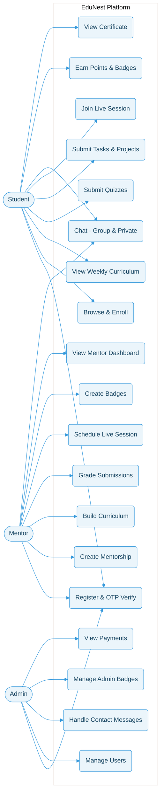
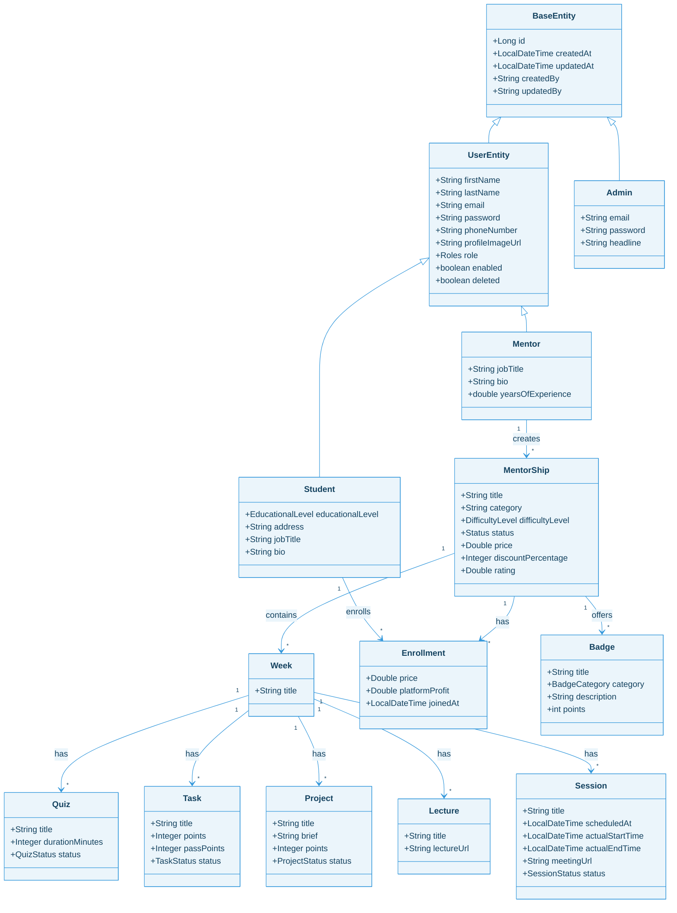

<div align="center">

# EduNest
### Next-Generation Mentorship & Structured-Learning Platform

[](https://www.oracle.com/java/)
[](https://spring.io/projects/spring-boot)
[](https://spring.io/projects/spring-security)
[](https://www.mysql.com/)
[](#)
[](https://jitsi.org/)

A production-grade, modular educational ecosystem where every completed learning journey produces a verifiable certificate, a portfolio of submitted projects, and a public skill profile — turning passive learning into measurable, mentor-driven outcomes.
</div>

---

## Executive Summary
EduNest is a next-generation, mentor-led structured-learning platform designed to address the fundamental shortcomings of contemporary online education. It bridges the gap between passive online courses and real mentorship by empowering mentors to design week-by-week learning journeys containing lectures, quizzes, tasks, and capstone projects.

Unlike competitors that offer one-to-one mentorship (expensive and unscalable) or traditional MOOCs (passive with low completion rates), EduNest introduces a **scalable group mentorship model** integrating curriculum delivery, real-time communication, live sessions, assessments, gamification, and certification into a single ecosystem.

---

## The Problem & Our Solution
**The Problem:** The online learning market is flooded with platforms that rely on pre-recorded video content with no human oversight. Completion rates remain critically low, students receive no personal guidance, and they finish courses without verifiable credentials or portfolio-worthy projects. Tool fragmentation forces users to juggle video platforms, messaging apps, and grading spreadsheets.

**The Solution:** EduNest provides a centralized learning ecosystem that unifies every component of the online learning experience. 
- **For Students:** Structured checkpoints, real-time communication, graded submissions, and a gamified reward system.
- **For Mentors:** A unified tool to structure curricula, communicate with learners, and track their progress without needing third-party tools.

---

## Key Features & Scope

### 1. Centralized Learning & Group-Based Mentorship
Mentors create structured mentorship programs with defined curricula, pricing, and enrollment. Students join as cohorts, enabling collaborative learning, peer interaction, and community building at scale.

### 2. Weekly Curriculum Builder
Each mentorship is organized into ordered weeks containing:
- **Lectures**: External video URLs.
- **Quizzes**: MCQ formats with A/B/C/D choices and auto-grading.
- **Tasks**: File submissions with manual grading, points, and pass thresholds.
- **Projects**: Capstone assignments with briefs, deadlines, and point awards.

### 3. Live and Recorded Sessions
Mentors can schedule live sessions via **Jitsi Meet** with an automated lifecycle (`SCHEDULED` → `LIVE` → `ENDED`) and automatic student attendance tracking. 

### 4. Built-in Real-Time Communication
Powered by WebSocket STOMP, the platform offers group chat rooms per mentorship cohort and private one-to-one conversations. Secured with JWT at both handshake and per-message levels.

### 5. Gamification Engine & Badges
- **Badges**: 8 configurable categories (ACHIEVEMENT, PERFORMANCE, CONSISTENCY, PROBLEM_SOLVING, CREATIVITY, LEADERSHIP, COMMUNITY, SPECIAL_RECOGNITION).
- **Points & Leaderboards**: Points are accumulated per mentorship and displayed on cohort-specific leaderboards.
- **Admin Badges**: Platform-wide recognition like `TOP_MENTOR` and `INNOVATOR_AWARD`.

### 6. Measurable Outcomes (Certificates & Portfolios)
- **Automated PDF Certificates**: Generated via **iText7** upon mentorship completion, detailing cohort rank and issue date.
- **Student Skill Profiles**: Public profiles aggregating skills, social links (GitHub, LinkedIn), earned badges, certificates, and an auto-generated portfolio of graded project submissions.

### 7. Mentor Analytics Dashboard
Real-time visibility into enrollment statistics, platform commission/revenue tracking, and pending submission queues.

---

## Users and Roles

### STUDENT
- Register via email/OTP.
- Browse, filter, and enroll in mentorships.
- Navigate weekly curricula (Lectures, Quizzes, Tasks, Projects).
- Submit files securely (validated by Apache Tika).
- Engage in real-time chat and join live Jitsi sessions.
- Earn points, badges, certificates, and build a public profile.

### MENTOR
- Create mentorships (`DRAFT` → `ACTIVE` → `COMPLETED`).
- Build week-by-week curricula and schedule live sessions.
- Grade tasks and projects manually.
- Create custom gamification badges.
- Track revenues and student progress via the Mentor Dashboard.

### ADMIN
- View and search all platform users via `AdminUserDirectory`.
- Handle "Contact Us" workflows (`PENDING` → `UNDER_REVIEW` → `COMPLETED`).
- Issue global Admin Badges.
- Access platform-wide analytics and payment overviews.
- Send broadcast notifications.

---

## System Architecture & Technologies

| Category | Technologies |
|----------|--------------|
| **Core Backend** | Java 21, Spring Boot 3.5.7 |
| **Security** | Spring Security 6 & jjwt 0.12.5 |
| **Database & ORM** | MySQL 8, Spring Data JPA |
| **Real-Time & Media** | Spring WebSocket + STOMP, Jitsi Meet API |
| **Document Processing**| Apache Tika 2.9.2, iText7 7.2.5 |
| **Tooling & Build** | Spring Mail, springdoc-openapi 2.7 |

---

## UML Diagrams Overview

### Use Case Diagram


### Core Domain (Class Diagram)


---

## Full Documentation
For a complete, in-depth view of the system analysis, comprehensive sequence diagrams, API details, feasibility study, and competitive analysis, please refer to the main project documentation file:

**[EduNest Project Documentation](EduNest_Project_Documentation1.md)**

---

## How to Run Locally

1. **Clone the repository:**
   ```bash
   git clone https://github.com/MooRaa86/EduNest.git
   cd EduNest
   ```
2. **Configure the Database:**
   - Ensure MySQL 8 is running locally.
   - Update `src/main/resources/application.properties` with your DB credentials and SMTP email settings.
3. **Build the project:**
   ```bash
   mvn clean install
   ```
4. **Run the application:**
   ```bash
   mvn spring-boot:run
   ```


</div>